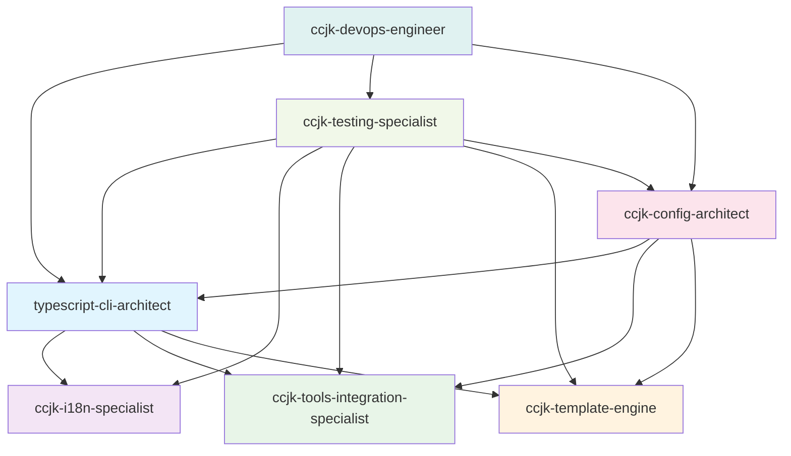

# CLAUDE.md

**Last Updated**: Sun Jan 12 15:57:33 CST 2026

---

## 🐉 Twin Dragons Philosophy | 双龙戏珠共生理念

> **"没有 Claude Code 就没有 CCJK，没有 CCJK 就没有更好的 Claude Code 体验"**
>
> *"Without Claude Code, there is no CCJK. Without CCJK, there is no better Claude Code experience."*

### The Vision | 愿景

CCJK exists for one purpose: **to make Claude Code the best AI programming experience possible**. We are not a replacement, not a competitor — we are the **cognitive enhancement layer** that unlocks Claude Code's full potential.

```
┌─────────────────────────────────────────────────────────────────┐
│                    🐉 双龙戏珠 Twin Dragons 🐉                    │
├─────────────────────────────────────────────────────────────────┤
│                                                                  │
│     ╭──────────────╮              ╭──────────────╮              │
│     │ Claude Code  │    🔮        │    CCJK      │              │
│     │  原生龙       │   Pearl     │   增强龙      │              │
│     │ Native Dragon│  (最佳体验)  │ Enhancement  │              │
│     ╰──────┬───────╯             ╰───────┬──────╯              │
│            │                              │                      │
│            │    ╭────────────────╮       │                      │
│            ╰────┤  开发者体验     ├───────╯                      │
│                 │ Developer UX   │                              │
│                 ╰────────────────╯                              │
│                                                                  │
│  Claude Code provides power → CCJK amplifies experience         │
│  User feedback improves both → Symbiotic evolution              │
│                                                                  │
└─────────────────────────────────────────────────────────────────┘
```

### Core Principles | 核心原则

#### 1. 🎯 **Symbiotic Enhancement** | 共生增强
- CCJK enhances, never replaces Claude Code functionality
- Every feature must improve the Claude Code experience
- We follow Claude Code's evolution and adapt accordingly

#### 2. 🚀 **Zero-Friction Philosophy** | 零摩擦哲学
- One command (`npx ccjk`) should solve 95% of setup needs
- Make the complex simple, make the simple invisible
- Users should focus on coding, not configuration

#### 3. 🧠 **Cognitive Load Reduction** | 认知负载降低
- Automate repetitive tasks that distract from development
- Provide intelligent defaults that work for most cases
- Offer advanced options for power users without overwhelming beginners

#### 4. 🔄 **Synchronized Evolution** | 同步进化
- Track Claude Code releases and adapt within 48 hours
- Anticipate user needs based on Claude Code's direction
- Contribute insights back to the Claude Code ecosystem

#### 5. 🌍 **Universal Accessibility** | 普惠可及
- Support all platforms where Claude Code runs
- Provide multilingual support (zh-CN, en, ja, ko)
- Ensure accessibility for developers of all skill levels

### Value Proposition | 价值主张

| Claude Code Alone | With CCJK | Improvement |
|:------------------|:----------|:-----------:|
| Manual 15+ step configuration | One-click setup | **↓95% time** |
| Manual context management | Intelligent orchestration | **↓73% tokens** |
| Single AI response | Multi-agent collaboration | **↑89% quality** |
| Isolated tool usage | Unified ecosystem | **↓80% switching** |
| Manual updates | Auto-sync evolution | **Zero downtime** |

### Development Mantra | 开发箴言

```
我们为 Claude Code 而生
We exist for Claude Code

我们让用户更傻瓜地使用它
We make it foolproof for users

我们补齐它的疏漏
We fill its gaps

我们放大它的能力
We amplify its power

双龙戏珠，共生共荣
Twin dragons, symbiotic prosperity
```

---

## Project Overview

CCJK (Claude Code JinKu) is a CLI tool that automatically configures Claude Code environments. Built with TypeScript and distributed as an npm package, it provides one-click setup for Claude Code including configuration files, API settings, MCP services, and AI workflows. The current version v3.4.3 features advanced i18next internationalization, enhanced engineering templates, intelligent IDE detection, comprehensive multi-platform support including Termux compatibility, sophisticated uninstallation capabilities with advanced conflict resolution, and API provider preset system for simplified configuration. The project also integrates dual code tool support, enabling both Claude Code and Codex environment configuration, with consolidated template architecture for shared resources.

## Architecture Overview

CCJK follows a modular CLI architecture with strict TypeScript typing, comprehensive i18next-based internationalization, and cross-platform support. The project is built using modern tooling including unbuild, Vitest, ESM-only configuration, and @antfu/eslint-config for code quality. The architecture emphasizes robust error handling, user-friendly interfaces, and extensive testing coverage with advanced tool integration including CCR proxy, Cometix status line, and CCusage analytics. Version 3.4.x introduces consolidated template architecture with shared resources in `templates/common/` for output styles, git workflows, and sixStep workflows, enabling code reuse between Claude Code and Codex.

### Module Structure Diagram

```mermaid
graph TD
    A["🚀 CCJK Root (v3.4.3)"] --> B["src/commands"];
    A --> C["src/utils"];
    A --> D["src/i18n"];
    A --> E["src/types"];
    A --> F["src/config"];
    A --> G["templates"];
    A --> H["tests"];

    B --> B1["init.ts - Full initialization"];
    B --> B2["menu.ts - Interactive UI"];
    B --> B3["update.ts - Workflow updates"];
    B --> B4["ccr.ts - Router management"];
    B --> B5["ccu.ts - Usage analysis"];
    B --> B6["check-updates.ts - Tool updates"];
    B --> B7["uninstall.ts - CCJK uninstallation"];
    B --> B8["config-switch.ts - Config switching"];

    C --> C1["config.ts - Configuration management"];
    C --> C2["installer.ts - Claude Code installation"];
    C --> C3["mcp.ts - MCP services"];
    C --> C4["platform.ts - Cross-platform support"];
    C --> C5["workflow-installer.ts - Workflow management"];
    C --> C6["ccr/ - CCR integration"];
    C --> C7["cometix/ - Status line tools"];
    C --> C8["tools/ - Tool integration"];
    C --> C9["uninstaller.ts - Advanced uninstaller"];
    C --> C10["trash.ts - Cross-platform trash"];
    C --> C11["code-tools/ - Codex integration"];

    D --> D1["locales/zh-CN/ - Chinese translations"];
    D --> D2["locales/en/ - English translations"];
    D --> D3["index.ts - i18next system"];
    D --> D4["Advanced namespace organization"];
    D --> D5["uninstall.json - Uninstall translations"];

    E --> E1["workflow.ts - Workflow types"];
    E --> E2["config.ts - Configuration types"];
    E --> E3["ccr.ts - CCR types"];
    E --> E4["claude-code-config.ts - Claude Code types"];
    E --> E5["toml-config.ts - TOML types"];

    F --> F1["workflows.ts - Workflow definitions"];
    F --> F2["mcp-services.ts - MCP configurations"];

    G --> G1["claude-code/ - Claude Code templates"];
    G --> G2["codex/ - Codex templates"];
    G --> G3["common/ - Shared templates (output-styles, git, sixStep)"];

    H --> H1["commands/ - Command tests"];
    H --> H2["utils/ - Utility tests"];
    H --> H3["unit/ - Unit test suites"];
    H --> H4["integration/ - Integration tests"];
    H --> H5["edge/ - Edge case tests"];
    H --> H6["i18n/ - I18n tests"];
    H --> H7["templates/ - Template tests"];

    click B "./src/commands/CLAUDE.md" "View commands module"
    click C "./src/utils/CLAUDE.md" "View utils module"
    click D "./src/i18n/CLAUDE.md" "View i18n module"
    click E "./src/types/CLAUDE.md" "View types module"
    click F "./src/config/CLAUDE.md" "View config module"
    click G "./templates/claude-code/CLAUDE.md" "View templates module"
    click H "./tests/CLAUDE.md" "View tests module"
```



## Module Index

| Module | Path | Description | Entry Points | Test Coverage |
|------------------------|--------------|---------------------------------------|-------------------------------------------------------|-------------------------------|
| **Commands** | `src/commands/` | CLI command implementations with advanced interactive and non-interactive modes including comprehensive uninstallation and config switching | init.ts, menu.ts, update.ts, ccr.ts, ccu.ts, check-updates.ts, uninstall.ts, config-switch.ts | High - comprehensive test suites |
| **Utilities** | `src/utils/` | Core functionality with enhanced configuration management, platform support, Codex integration, and advanced uninstallation capabilities | config.ts, installer.ts, platform.ts, workflow-installer.ts, ccr/, cometix/, code-tools/, uninstaller.ts, trash.ts | High - extensive unit tests |
| **CCR Integration** | `src/utils/ccr/` | Claude Code Router proxy management and configuration | presets.ts, commands.ts, installer.ts, config.ts | High - comprehensive CCR tests |
| **Cometix Tools** | `src/utils/cometix/` | Status line tools and configuration management | errors.ts, common.ts, types.ts, commands.ts, installer.ts, menu.ts | High - extensive Cometix tests |
| **Code Tools** | `src/utils/code-tools/` | Codex integration and dual code tool support | codex-config-detector.ts, codex-provider-manager.ts, codex-uninstaller.ts, codex-platform.ts, codex-config-switch.ts, codex-configure.ts, codex.ts | High - comprehensive Codex tests |
| **Internationalization** | `src/i18n/` | Advanced i18next multilingual support with namespace organization and complete uninstall translations | index.ts, locales/zh-CN/, locales/en/ | High - translation validation |
| **Types** | `src/types/` | Comprehensive TypeScript type definitions including Claude Code and TOML config types | workflow.ts, config.ts, ccr.ts, claude-code-config.ts, toml-config.ts | Implicit through usage |
| **Configuration** | `src/config/` | Centralized workflow and system configurations including API provider presets | workflows.ts, mcp-services.ts, api-providers.ts | High - config validation tests |
| **Templates** | `templates/` | Consolidated multilingual templates with shared resources in common/ for output-styles, git workflows, and sixStep workflows | claude-code/, codex/, common/ (output-styles, workflow/git, workflow/sixStep) | Medium - template validation tests |
| **Testing** | `tests/` | Comprehensive test suites with layered coverage architecture and advanced uninstaller testing | commands/, utils/, unit/, integration/, edge/, i18n/, templates/ | Self-testing with 80% target |

## Project Statistics

- **Total Files**: ~517 files (TypeScript, JSON, Markdown)
- **Source Files**: 74 TypeScript files in `src/`
- **Test Files**: 122 test files with comprehensive coverage
- **Translation Files**: 34 JSON files (17 per locale: zh-CN, en)
- **Template Files**: 54 template files for workflows and output styles
- **Module Count**: 10 major modules with clear separation of concerns

## CLI Usage

CCJK provides both direct commands and an interactive menu system with advanced internationalization and comprehensive uninstallation:

```bash
# Interactive menu (recommended)
npx ccjk                    # Opens main menu with all options

# Direct commands
npx ccjk i                  # Full initialization
npx ccjk u                  # Update workflows only
npx ccjk ccr [--lang <en|zh-CN>]  # Claude Code Router management
npx ccjk ccu [args...]      # Run ccusage with arguments
npx ccjk check-updates [--lang <en|zh-CN>] [--code-type <claude-code|codex>]  # Check tool updates
npx ccjk config-switch [target] [--code-type <claude-code|codex>]  # Switch configurations
npx ccjk uninstall [--mode <complete|custom|interactive>] [--items <items>] [--lang <en|zh-CN>]  # CCJK uninstallation

# Config switch examples
npx ccjk config-switch --list                    # List available configurations
npx ccjk config-switch provider1 --code-type codex  # Switch Codex provider
npx ccjk config-switch config1 --code-type claude-code  # Switch Claude Code config

# Uninstall examples
npx ccjk uninstall                                    # Interactive uninstall menu
npx ccjk uninstall --mode complete                    # Complete uninstallation
npx ccjk uninstall --mode custom --items ccr,backups # Custom uninstallation
```

## Running and Development

### Build & Run

```bash
# Development (uses tsx for TypeScript execution)
pnpm dev

# Build for production (uses unbuild)
pnpm build

# Type checking
pnpm typecheck
```

### Code Quality & Linting

```bash
# Run ESLint (uses @antfu/eslint-config)
pnpm lint

# Fix ESLint issues automatically
pnpm lint:fix
```

### Documentation

```bash
# Start VitePress documentation development server
pnpm docs:dev

# Build documentation for production
pnpm docs:build

# Preview built documentation
pnpm docs:preview
```

### Testing Strategy

```bash
# Run all tests
pnpm test

# Run tests in watch mode (for development)
pnpm test:watch

# Run tests with UI
pnpm test:ui

# Generate coverage report
pnpm test:coverage

# Run tests once
pnpm test:run

# Run specific test file
pnpm vitest utils/config.test.ts

# Run tests matching pattern
pnpm vitest --grep "should handle"

# Run uninstaller tests specifically
pnpm vitest uninstaller
```

The project uses Vitest with a comprehensive layered testing approach:

1. **Core Tests** (`*.test.ts`) - Basic functionality and main flows
2. **Edge Tests** (`*.edge.test.ts`) - Boundary conditions and error scenarios
3. **Unit Tests** (`tests/unit/`) - Isolated function testing
4. **Integration Tests** (`tests/integration/`) - Cross-module interaction testing
5. **Coverage Goals**: 80% minimum across lines, functions, branches, and statements

## Development Guidelines

### 🐉 Twin Dragons Decision Framework | 双龙决策框架

Before implementing any feature, ask these questions:

```
┌─────────────────────────────────────────────────────────────────┐
│              Feature Decision Checklist | 功能决策清单            │
├─────────────────────────────────────────────────────────────────┤
│                                                                  │
│  ✅ Does this enhance Claude Code experience?                    │
│     这是否增强了 Claude Code 体验？                               │
│                                                                  │
│  ✅ Does this reduce user cognitive load?                        │
│     这是否降低了用户认知负担？                                    │
│                                                                  │
│  ✅ Does this follow Claude Code's design philosophy?            │
│     这是否遵循 Claude Code 的设计理念？                          │
│                                                                  │
│  ✅ Can this be done with fewer steps for the user?              │
│     用户能否用更少的步骤完成？                                    │
│                                                                  │
│  ✅ Will this still work when Claude Code updates?               │
│     当 Claude Code 更新时这是否仍然有效？                        │
│                                                                  │
│  ❌ Does this duplicate Claude Code's native functionality?      │
│     这是否重复了 Claude Code 的原生功能？                        │
│                                                                  │
│  ❌ Does this add unnecessary complexity?                        │
│     这是否增加了不必要的复杂性？                                  │
│                                                                  │
└─────────────────────────────────────────────────────────────────┘
```

### Feature Categories | 功能分类

| Category | Description | Priority | Example |
|:---------|:------------|:--------:|:--------|
| **Gap Filler** | Features Claude Code lacks | 🔴 High | MCP service management, API provider presets |
| **Experience Enhancer** | Makes existing features easier | 🟡 Medium | One-click setup, interactive menus |
| **Ecosystem Integrator** | Connects external tools | 🟢 Normal | CCR, CCUsage, Cometix integration |
| **Power User** | Advanced features for experts | 🔵 Low | Custom workflows, template engine |

### Claude Code Alignment | Claude Code 对齐

CCJK must stay aligned with Claude Code's core design philosophy:

#### Claude Code's Design Philosophy (from Anthropic)

```
┌─────────────────────────────────────────────────────────────────┐
│           Claude Code 官方设计理念 | Official Philosophy         │
├─────────────────────────────────────────────────────────────────┤
│                                                                  │
│  🎯 Low-level & Unopinionated                                   │
│     "Close to raw model access without forcing workflows"        │
│     底层且不强制特定工作流                                        │
│                                                                  │
│  🔧 Terminal-First, Unix Philosophy                              │
│     Composable, scriptable, integrates with existing tools       │
│     终端优先，Unix 哲学，可组合可脚本化                           │
│                                                                  │
│  🛡️ Safety Through Conservative Defaults                         │
│     Permission requests for system-modifying actions             │
│     通过保守默认值确保安全                                        │
│                                                                  │
│  🤝 Collaborative Agentic Development                            │
│     Humans remain active decision-makers                         │
│     人类保持主动决策者角色                                        │
│                                                                  │
└─────────────────────────────────────────────────────────────────┘
```

#### How CCJK Complements Claude Code

| Claude Code Principle | CCJK's Role | Implementation |
|:---------------------|:------------|:---------------|
| **Unopinionated** | Provide opinionated defaults that can be overridden | API provider presets, workflow templates |
| **Terminal-First** | Enhance terminal experience | Interactive menus, colored output, progress indicators |
| **Safety First** | Extend safety with backups | Automatic config backups, safe uninstallation |
| **Context Engineering** | Optimize context usage | CLAUDE.md templates, .claudeignore management |
| **MCP Extensibility** | Simplify MCP setup | One-click MCP service configuration |

#### Claude Code Pain Points CCJK Addresses

Based on community feedback, these are the gaps CCJK fills:

1. **Context Window Overload** → CCJK provides optimized CLAUDE.md templates
2. **Steep Learning Curve** → CCJK offers zero-config setup and guided workflows
3. **Configuration Complexity** → CCJK automates JSON/TOML editing
4. **Tool Integration Friction** → CCJK unifies CCR, CCUsage, Cometix setup
5. **Cross-Platform Issues** → CCJK handles Windows/macOS/Linux/Termux differences

### Core Principles

- **Documentation Language**: Except for README_zh-CN, all code comments and documentation should be written in English
  - Code comments must be in English
  - All documentation files (*.md) must be in English except README_zh-CN
  - API documentation and inline documentation must use English
  - Git commit messages should be in English

- **Test-Driven Development (TDD)**: All development must follow TDD methodology
  - Write tests BEFORE implementing functionality
  - Follow Red-Green-Refactor cycle: write failing test → implement minimal code → refactor
  - Ensure each function/feature has corresponding test coverage before implementation
  - When writing tests, first verify if relevant test files already exist to avoid unnecessary duplication
  - Minimum 80% coverage required across lines, functions, branches, and statements

- **Internationalization (i18n) Guidelines**:
  - All user-facing prompts, logs, and error messages must support i18n via i18next
  - Use project-wide i18n approach with centralized language management
  - Implement translations consistently across the entire project using namespace-based organization
  - Support both zh-CN and en locales with complete feature parity
  - Use `i18n.t()` function for all translatable strings with proper namespace prefixes
  - Organize translations in logical namespaces (common, cli, menu, errors, api, tools, uninstall, etc.)

## Coding Standards

- **ESM-Only**: Project is fully ESM with no CommonJS fallbacks
- **Path Handling**: Uses `pathe` for cross-platform path operations
- **Command Execution**: Uses `tinyexec` for better cross-platform support
- **TypeScript**: Strict TypeScript with explicit type definitions and ESNext configuration
- **Error Handling**: Comprehensive error handling with user-friendly i18n messages
- **Cross-Platform Support**: Special handling for Windows paths, macOS, Linux, and Termux environment
- **Code Formatting**: Uses @antfu/eslint-config for consistent code style with strict rules
- **Testing Organization**: Tests organized with comprehensive unit/integration/edge structure and 80% coverage requirement
- **Trash/Recycle Bin Integration**: Uses `trash` package for safe cross-platform file deletion

## 🤖 CCJK AI Team Configuration

The CCJK project employs a specialized AI agent team optimized for CLI development, i18n systems, and tool integration. Each agent is designed with specific domain expertise and strict boundaries to ensure efficient collaboration.

### Project-Specific AI Agents

| Agent | Model | Domain | Primary Responsibilities |
|-------|-------|--------|-------------------------|
| **typescript-cli-architect** | sonnet | CLI Architecture | TypeScript CLI design, CAC integration, ESM modules, developer experience |
| **ccjk-i18n-specialist** | opus | Internationalization | i18next configuration, translation management, namespace organization |
| **ccjk-tools-integration-specialist** | sonnet | Tool Integration | CCR/Cometix/CCusage integration, version management, cross-platform compatibility |
| **ccjk-template-engine** | haiku | Template System | Template design, workflow configurations, output styles, multilingual templates |
| **ccjk-config-architect** | opus | Configuration Management | Config merging, MCP services, TOML/JSON validation, backup systems |
| **ccjk-testing-specialist** | sonnet | Testing Infrastructure | Vitest configuration, test coverage, mock systems, quality assurance |
| **ccjk-devops-engineer** | inherit | DevOps & Deployment | Build optimization, release management, CI/CD, cross-platform deployment |

### Agent Collaboration Matrix



### Agent Boundaries & Delegation Rules

- **CLI Architecture**: typescript-cli-architect handles all CLI structure, command parsing, and TypeScript configuration
- **Internationalization**: ccjk-i18n-specialist manages all i18next systems, translations, and language detection
- **Tool Integration**: ccjk-tools-integration-specialist handles CCR, Cometix, CCusage integration and version management
- **Templates**: ccjk-template-engine manages all template systems, workflow configurations, and output styles
- **Configuration**: ccjk-config-architect handles complex config merging, MCP services, and backup systems
- **Testing**: ccjk-testing-specialist maintains Vitest infrastructure, coverage, and quality assurance
- **DevOps**: ccjk-devops-engineer manages builds, releases, and deployment processes

### Model Selection Rationale

- **Opus**: Complex reasoning for i18n logic and configuration architecture
- **Sonnet**: Balanced performance for CLI architecture, tool integration, and testing
- **Haiku**: Fast response for template processing and simple operations
- **Inherit**: Cost-effective for DevOps tasks that don't require specialized models

## 🔧 Tool Selection Strategy | 工具选择策略

### Browser Automation Tool Priority | 浏览器自动化工具优先级

> **核心原则**: Agent Browser 优先于 Playwright MCP

当需要进行网页自动化、浏览器控制、UI 测试或网页抓取时，**必须优先使用 `agent-browser` CLI 工具**，而不是 Playwright MCP。

#### Why Agent Browser First? | 为什么优先 Agent Browser？

| 对比项 | Agent Browser (推荐) | Playwright MCP |
|--------|---------------------|----------------|
| **配置** | 零配置，开箱即用 | 需要 MCP JSON 配置 |
| **内存** | 极小 (~10MB) | 重量级 (200-500MB) |
| **速度** | 原生 Rust CLI | Node.js 开销 |
| **AI 原生** | 基于引用 (@e1, @e2) | CSS 选择器 |
| **Linux 兼容** | ✅ 完美支持 | ⚠️ 需要额外依赖 |
| **学习曲线** | 5 分钟 | 数小时 |

#### Tool Selection Rules | 工具选择规则

```
┌─────────────────────────────────────────────────────────────────┐
│              浏览器自动化工具选择决策树                            │
├─────────────────────────────────────────────────────────────────┤
│                                                                  │
│  需要浏览器自动化？                                               │
│       │                                                          │
│       ▼                                                          │
│  ┌─────────────────┐                                            │
│  │ 使用 agent-browser │  ← 默认选择（通过 Bash 调用）             │
│  │ (CLI 工具)        │                                           │
│  └─────────────────┘                                            │
│       │                                                          │
│       ▼                                                          │
│  agent-browser 不可用或失败？                                     │
│       │                                                          │
│       ├── 是 → 回退到 Playwright MCP (mcp__Playwright__*)        │
│       │                                                          │
│       └── 否 → 继续使用 agent-browser                            │
│                                                                  │
└─────────────────────────────────────────────────────────────────┘
```

#### Agent Browser Quick Reference | 快速参考

```bash
# 核心工作流
agent-browser open <url>           # 导航到 URL
agent-browser snapshot -i          # 获取交互元素（带引用）
agent-browser click @e1            # 通过引用点击
agent-browser fill @e2 "text"      # 通过引用填充
agent-browser screenshot page.png  # 截图
agent-browser close                # 关闭浏览器

# 等待操作
agent-browser wait 2000            # 等待 2 秒
agent-browser wait @e1             # 等待元素出现
agent-browser wait --text "Success" # 等待文本出现

# 获取信息
agent-browser get text @e1         # 获取文本内容
agent-browser get url              # 获取当前 URL
agent-browser get title            # 获取页面标题
```

#### When to Use Playwright MCP | 何时使用 Playwright MCP

仅在以下情况使用 Playwright MCP：
1. `agent-browser` 命令不可用（未安装）
2. 需要 Playwright 特有的高级功能（如网络拦截、多标签页复杂操作）
3. 用户明确要求使用 Playwright

#### Environment-Specific Guidance | 环境特定指导

| 环境 | 首选工具 | 原因 |
|------|----------|------|
| **Linux (服务器/CI)** | `agent-browser` | 无 GUI 依赖，轻量级 |
| **Linux (桌面)** | `agent-browser` | 更简单的依赖管理 |
| **macOS** | `agent-browser` | 两者都可用，但 agent-browser 更轻量 |
| **Windows** | `agent-browser` | 避免 Playwright 的 Windows 路径问题 |
| **Termux** | `agent-browser` | 唯一可行的选择 |

#### Browser Installation for China Users | 中国用户浏览器安装

> **重要**: 中国用户下载 Playwright 浏览器时，默认 CDN 可能很慢或无法访问。使用国内镜像可大幅提升下载速度。

**使用淘宝镜像安装浏览器**:

```bash
# 设置环境变量使用国内镜像
export PLAYWRIGHT_DOWNLOAD_HOST=https://npmmirror.com/mirrors/playwright

# 然后安装浏览器
npx playwright install chromium

# 或者一行命令
PLAYWRIGHT_DOWNLOAD_HOST=https://npmmirror.com/mirrors/playwright npx playwright install chromium
```

**永久配置（推荐）**:

```bash
# 添加到 ~/.bashrc 或 ~/.zshrc
echo 'export PLAYWRIGHT_DOWNLOAD_HOST=https://npmmirror.com/mirrors/playwright' >> ~/.zshrc
source ~/.zshrc
```

**可用的国内镜像**:

| 镜像源 | 环境变量值 | 稳定性 |
|--------|-----------|--------|
| **淘宝镜像** (推荐) | `https://npmmirror.com/mirrors/playwright` | ⭐⭐⭐ |
| **华为云镜像** | `https://repo.huaweicloud.com/playwright` | ⭐⭐ |

**验证安装**:

```bash
# 检查浏览器是否安装成功
agent-browser open https://example.com && agent-browser snapshot -i -c && agent-browser close
```

### Other Tool Preferences | 其他工具偏好

| 任务类型 | 首选工具 | 备选工具 |
|----------|----------|----------|
| 文件搜索 | `Glob`, `Grep` | `Bash find/grep` |
| 文件读写 | `Read`, `Write`, `Edit` | `Bash cat/echo` |
| 代码执行 | `Bash` | - |
| 网页搜索 | `WebSearch` | `mcp__exa` |
| 文档查询 | `mcp__context7` | `WebFetch` |

---

## AI Usage Guidelines

### Key Architecture Patterns

1. **Advanced Modular Command Structure**: Each command is self-contained with comprehensive options interface and sophisticated error handling
2. **Advanced i18next I18N Support**: All user-facing strings support zh-CN and en localization with namespace-based organization and dynamic language switching
3. **Smart Configuration Merging**: Intelligent config merging with comprehensive backup system to preserve user customizations
4. **Comprehensive Cross-Platform Support**: Windows/macOS/Linux/Termux compatibility with platform-specific adaptations and path handling
5. **Consolidated Template System**: Shared templates in `templates/common/` for output-styles, git workflows, and sixStep workflows, reducing duplication between Claude Code and Codex
6. **Intelligent IDE Integration**: Advanced IDE detection and auto-open functionality for git-worktree environments
7. **Professional AI Personality System**: Multiple output styles including engineer-professional, laowang-engineer, nekomata-engineer, and ojousama-engineer
8. **Advanced Tool Integration**: Comprehensive integration with CCR proxy, CCusage analytics, and Cometix status line tools
9. **Sophisticated Uninstallation System**: Advanced uninstaller with conflict resolution, selective removal, and cross-platform trash integration
10. **Dual Code Tool Architecture**: Simultaneous support for Claude Code and Codex environment configuration with shared template resources

### Important Implementation Details

1. **Advanced Windows Compatibility**: MCP configurations require sophisticated Windows path handling with proper escaping and validation
2. **Comprehensive Configuration Backup**: All modifications create timestamped backups in `~/.claude/backup/` with full recovery capabilities
3. **Enhanced API Configuration**: Supports Auth Token (OAuth), API Key, and CCR Proxy authentication with comprehensive validation and API provider preset system (v3.3.3+)
4. **API Provider Preset System**: Pre-configured settings for popular providers (302.AI, GLM, MiniMax, Kimi) simplifying configuration from 5+ prompts to just 2 (provider + API key)
5. **Advanced Workflow System**: Modular workflow installation with sophisticated dependency resolution and conflict management
6. **Advanced CCR Integration**: Claude Code Router proxy management with configuration validation and preset management
7. **Intelligent Auto-Update System**: Automated tool updating for Claude Code, CCR, and CCometixLine with comprehensive version checking
8. **Advanced Common Tools Workflow**: Enhanced workflow category with init-project command and comprehensive agent ecosystem
9. **Consolidated Template System**: Shared templates architecture with `templates/common/` containing output-styles, git workflows, and sixStep workflows for code reuse
10. **Advanced i18next Integration**: Sophisticated internationalization with namespace-based translation management and dynamic language switching
11. **Comprehensive Tool Integration**: Advanced CCR, Cometix, and CCusage integration with version management and configuration validation
12. **Sophisticated Uninstaller**: Advanced ZCF uninstaller with selective removal, conflict resolution, and cross-platform trash integration

### Testing Philosophy

- **Comprehensive Mocking Strategy**: Extensive mocking for file system operations, external commands, and user prompts with realistic scenarios
- **Advanced Cross-platform Testing**: Platform detection mocks with comprehensive environment-specific test cases
- **Sophisticated Edge Case Testing**: Comprehensive boundary conditions, error scenarios, and advanced recovery mechanisms
- **Quality-Focused Coverage**: 80% minimum coverage across all metrics with emphasis on quality over quantity
- **Advanced Test Organization**: Tests organized in dedicated structure with clear categorization, helper functions, and test fixtures
- **Advanced Integration Testing**: Complete workflow scenarios and comprehensive external tool interaction testing
- **Uninstaller Edge Case Testing**: Comprehensive uninstallation scenarios testing including failure recovery and conflict resolution

## Release & Publishing

```bash
# Create a changeset for version updates
pnpm changeset

# Update package version based on changesets
pnpm version

# Build and publish to npm
pnpm release
```

### ⚠️ CRITICAL: pnpm catalog: Protocol Issue

**PROBLEM**: pnpm's `catalog:` protocol in `package.json` causes npm install failures!

When using `catalog:` references like `"dayjs": "catalog:"`, these references are NOT resolved during `npm publish`. Users installing via npm will get:

```
npm error code EUNSUPPORTEDPROTOCOL
npm error Unsupported URL Type "catalog:": catalog:
```

**ROOT CAUSE**: The `catalog:` protocol is a pnpm workspace feature defined in `pnpm-workspace.yaml`. While pnpm resolves these during local development, the raw `catalog:` strings get published to npm registry, which npm cannot understand.

**REQUIRED FIX BEFORE EVERY PUBLISH**:

```bash
# Step 1: Check for catalog: references
grep -c "catalog:" package.json  # If > 0, need to fix

# Step 2: Replace with actual versions (Node.js script)
cat > /tmp/fix-package.mjs << 'ENDSCRIPT'
import { readFile, writeFile } from 'node:fs/promises';

const packageJson = JSON.parse(await readFile('package.json', 'utf-8'));

// Versions from pnpm-workspace.yaml catalog section
const versions = {
  // Dependencies
  '@anthropic-ai/sdk': '^0.52.0',
  '@iarna/toml': '^2.2.5',
  '@types/semver': '^7.7.1',
  '@types/tar': '^6.1.13',
  'ansis': '^4.1.0',
  'cac': '^6.7.14',
  'chalk': '^5.6.2',
  'chokidar': '^4.0.3',
  'commander': '^14.0.2',
  'dayjs': '^1.11.18',
  'find-up-simple': '^1.0.1',
  'fs-extra': '^11.3.2',
  'gray-matter': '^4.0.3',
  'i18next': '^25.5.2',
  'i18next-fs-backend': '^2.6.0',
  'imap': '^0.8.19',
  'inquirer': '^12.9.6',
  'inquirer-toggle': '^1.0.1',
  'mailparser': '^3.9.1',
  'nanoid': '^5.1.6',
  'nodemailer': '^7.0.12',
  'ora': '^9.0.0',
  'pathe': '^2.0.3',
  'semver': '^7.7.2',
  'smol-toml': '^1.4.2',
  'tar': '^7.5.2',
  'tinyexec': '^1.0.1',
  'trash': '^10.0.0',
  'zod': '^3.22.4',
  // DevDependencies
  '@antfu/eslint-config': '^5.4.1',
  '@types/fs-extra': '^11.0.4',
  '@types/imap': '^0.8.43',
  '@types/inquirer': '^9.0.9',
  '@types/jest': '^29.5.0',
  '@types/mailparser': '^3.4.6',
  '@types/node': '^22.18.6',
  '@types/nodemailer': '^7.0.5',
  '@typescript-eslint/eslint-plugin': '^6.0.0',
  '@typescript-eslint/parser': '^6.0.0',
  '@vitest/coverage-v8': '^3.2.4',
  '@vitest/ui': '^3.2.4',
  'eslint': '^9.36.0',
  'eslint-plugin-format': '^1.0.2',
  'glob': '^11.0.3',
  'husky': '^9.1.7',
  'jest': '^29.5.0',
  'lint-staged': '^16.2.0',
  'prettier': '^3.0.0',
  'ts-jest': '^29.1.0',
  'tsx': '^4.20.5',
  'typescript': '^5.9.2',
  'unbuild': '^3.6.1',
  'vitest': '^3.2.4'
};

for (const [pkg, version] of Object.entries(versions)) {
  if (packageJson.dependencies?.[pkg]) {
    packageJson.dependencies[pkg] = version;
  }
  if (packageJson.devDependencies?.[pkg]) {
    packageJson.devDependencies[pkg] = version;
  }
}

await writeFile('package.json', JSON.stringify(packageJson, null, 2) + '\n');
console.log('Fixed package.json');
ENDSCRIPT

node /tmp/fix-package.mjs

# Step 3: Verify no catalog: references remain
grep -c "catalog:" package.json  # Should return 0

# Step 4: Build and publish
pnpm build
npm publish --access public

# Step 5: Verify published package
npm view ccjk@<version> dependencies --json | grep -c "catalog:"  # Should return 0
```

**PREVENTION CHECKLIST**:
1. ✅ Always verify `grep -c "catalog:" package.json` returns 0 before publishing
2. ✅ Test installation with `npm install ccjk@<version>` (not pnpm) after publishing
3. ✅ Check `npm view ccjk@<version> dependencies` to confirm no catalog: references
4. ❌ NEVER restore package.json with catalog: references after publish

**VERSION CONTROL NOTE**:
- Keep `package.json` WITHOUT catalog: references as the committed version
- For local development with pnpm workspace, you can temporarily add catalog: back, but NEVER commit this version
- The git-tracked version must always have semantic versions for npm compatibility

---

**Important Reminders**:

- Do what has been asked; nothing more, nothing less
- NEVER create files unless absolutely necessary for achieving your goal
- ALWAYS prefer editing an existing file to creating a new one
- NEVER proactively create documentation files (*.md) or README files. Only create documentation files if explicitly requested by the User.
- Never save working files, text/mds and tests to the root folder