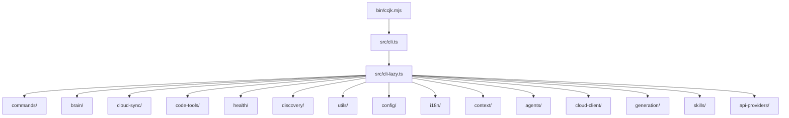

# CLAUDE.md

This file provides guidance to Claude Code (claude.ai/code) when working with code in this repository.

## Changelog

| Date | Version | Change |
|------|---------|--------|
| 2026-02-27 | 12.0.15 | Menu system refactored: hierarchical menu with 3-level structure, unified shortcuts (1-8, L, H, Q), optimized i18n (8-12 chars CN, 20-40 chars EN), enabled via CCJK_HIERARCHICAL_MENU=1 |
| 2026-02-27 | 12.0.15 | CLAUDE.md review: added Quick Start section and debugging gotchas |
| 2026-02-25 | 12.0.8 | Wire up smartGenerateAndInstall: add `generate`/`gen` CLI command, menu G. option, post-init prompt, help doc entry |
| 2026-02-25 | 12.0.7 | Architecture diagram added; module index expanded to cover all src/ modules; module-level CLAUDE.md files generated |

## Project Overview

CCJK is a TypeScript CLI tool that configures AI coding environments. It provides one-click setup for Claude Code, Codex, and other AI code tools with MCP services, API configuration, and workflow templates.

**Key capabilities:**
- Brain System: Multi-agent orchestration with context compression
- Cloud Sync: Configuration synchronization via GitHub Gist, WebDAV, or S3
- MCP Marketplace: One-click MCP service installation
- Health Monitor: Score-based setup quality assessment (`ccjk status`)
- Code Tool Abstraction: Unified interface for Claude Code, Codex, Aider, Continue, Cline, Cursor
- Cloud Client: Remote skills marketplace, recommendations, and telemetry
- Smart Generation: Auto-detect project type and generate agents/skills

## Anti-Aggression Principle

CCJK complements Claude Code CLI — it does NOT compete with it. Critical rules:
- Skills must ONLY run when user explicitly invokes them
- No unsolicited output (no welcome banners, no auto-print on startup)
- Brain hook runs in silent mode
- `bootstrapCloudServices()` is skipped entirely during interactive menu to prevent config write races

## Architecture Overview


```mermaid
graph TD
    A["bin/ccjk.mjs"] --> B["src/cli.ts"]
    B --> C["src/cli-lazy.ts"]
    C --> D["commands/"]
    C --> E["brain/"]
    C --> F["cloud-sync/"]
    C --> G["code-tools/"]
    C --> H["health/"]
    C --> I["discovery/"]
    C --> J["utils/"]
    C --> K["config/"]
    C --> L["i18n/"]
    C --> M["context/"]
    C --> N["agents/"]
    C --> O["cloud-client/"]
    C --> P["generation/"]
    C --> Q["skills/"]
    C --> R["api-providers/"]

    click D "./src/commands/CLAUDE.md" "Commands module"
    click E "./src/brain/CLAUDE.md" "Brain module"
    click F "./src/cloud-sync/CLAUDE.md" "Cloud Sync module"
    click G "./src/code-tools/CLAUDE.md" "Code Tools module"
    click H "./src/health/CLAUDE.md" "Health module"
    click I "./src/discovery/CLAUDE.md" "Discovery module"
    click J "./src/utils/CLAUDE.md" "Utils module"
    click K "./src/config/CLAUDE.md" "Config module"
    click L "./src/i18n/CLAUDE.md" "i18n module"
    click M "./src/context/CLAUDE.md" "Context module"
    click N "./src/agents/CLAUDE.md" "Agents module"
    click O "./src/cloud-client/CLAUDE.md" "Cloud Client module"
    click P "./src/generation/CLAUDE.md" "Generation module"
    click Q "./src/skills/CLAUDE.md" "Skills module"
    click R "./src/api-providers/CLAUDE.md" "API Providers module"
```

## Module Index

| Module | Path | Responsibility |
|--------|------|----------------|
| CLI Entry | `src/cli.ts` + `src/cli-lazy.ts` | Lazy-loading command registration (~2200 lines) |
| commands | `src/commands/` | All CLI command implementations (init, menu, mcp, agents, etc.) |
| brain | `src/brain/` | Multi-agent orchestration, skill hot-reload, session management |
| cloud-sync | `src/cloud-sync/` | Config sync via GitHub Gist, WebDAV, S3 |
| cloud-client | `src/cloud-client/` | Remote API client: skills marketplace, recommendations, telemetry |
| code-tools | `src/code-tools/` | Unified abstraction for Claude Code, Codex, Aider, Continue, Cline, Cursor |
| health | `src/health/` | Score-based health check engine (6 weighted checks) |
| discovery | `src/discovery/` | Project analyzer + skill/MCP matcher |
| context | `src/context/` | Context window management, compression, caching, analytics |
| agents | `src/agents/` | Cowork orchestration patterns for multi-agent tasks |
| generation | `src/generation/` | Smart project analysis → agent/skill config generation |
| skills | `src/skills/` | Skill registry, auto-trigger, intent detection |
| api-providers | `src/api-providers/` | Multi-provider API management (302.AI, GLM, OpenAI, Anthropic, etc.) |
| config | `src/config/` | Workflow, MCP service, and API provider definitions |
| utils | `src/utils/` | Config management, platform support, installer, workflow installer |
| i18n | `src/i18n/` | i18next with zh-CN and en locales (15 translation modules) |
| cli/completion | `src/cli/` | Shell completion for Bash, Zsh, Fish, PowerShell |

## Quick Start

```bash
# 1. Install dependencies
pnpm install

# 2. Build the project
pnpm build

# 3. Run in dev mode
pnpm dev

# 4. Test the CLI
node dist/cli.mjs --help
echo '1' | node dist/cli.mjs 2>&1  # Test menu option 1
```

**First-time contributors:**
1. Read the Anti-Aggression Principle section
2. Understand the Menu → Feature Function Mapping
3. Run `pnpm typecheck && pnpm build` before committing

## Build and Development Commands

```bash
pnpm dev                    # Run CLI in development mode (tsx)
pnpm build                  # Production build (unbuild)
pnpm typecheck              # TypeScript type checking
pnpm lint                   # ESLint check
pnpm lint:fix               # Auto-fix ESLint issues
pnpm test:run               # Run tests once (no watch)
pnpm vitest <pattern>       # Run specific test file
pnpm test:e2e               # End-to-end tests
```

**Quick verification:** `pnpm typecheck && pnpm build`

**Test a menu option:** `echo '<option>' | node dist/cli.mjs 2>&1`

## Architecture

### Entry Point Flow

`bin/ccjk.mjs` → `src/cli.ts` → `src/cli-lazy.ts` (actual command registration)

`cli-lazy.ts` is the real entry point (~2200 lines). It uses a tiered lazy-loading system:
- **core**: Commands registered at startup, executed lazily (init, menu, status, boost)
- **extended**: Fully lazy-loaded (doctor, mcp, codex, etc.)
- **deprecated**: Show migration messages

### Key Modules

```
src/
├── cli-lazy.ts             # Actual entry point, lazy command registration (~2200 lines)
├── commands/
│   ├── menu.ts             # Main interactive menu (options 1-7 + extras)
│   ├── init.ts             # Full init flow and simplified init
│   ├── status.ts           # Brain Dashboard (health score + recommendations)
│   └── boost.ts            # One-click optimization
├── brain/                  # Multi-agent orchestration
├── cloud-sync/             # Cloud config sync (Gist, WebDAV, S3)
├── cloud-client/           # Remote API: skills marketplace, recommendations, telemetry
├── code-tools/             # Code tool abstraction layer
├── health/                 # Health scoring engine (6 weighted checks)
├── discovery/              # Project analyzer + skill/MCP matcher
├── generation/             # Smart agent/skill generation from project analysis
├── skills/                 # Skill registry, auto-trigger, intent detection
├── context/                # Context window management and compression
├── agents/                 # Cowork orchestration patterns
├── api-providers/          # Multi-provider API management
├── utils/
│   ├── features.ts         # Feature functions called by menu
│   ├── config.ts           # Settings.json management
│   ├── claude-config.ts    # MCP config management
│   └── permission-cleaner.ts # Permission validation and repair
├── config/                 # Workflow, MCP, API provider definitions
└── i18n/                   # i18next (zh-CN, en)
```

### Menu → Feature Function Mapping

This is the most critical flow. Menu options in `src/commands/menu.ts` must call specific functions:
- **Option 1**: `init({ skipBanner: true })` — NOT `simplifiedInit()`
- **Option 3**: `configureApiFeature()` from `utils/features.ts`
- **Option 4**: `configureMcpFeature()` from `utils/features.ts`
- **Options 5-7**: `configureDefaultModelFeature` / `configureAiMemoryFeature` / `configureEnvPermissionFeature`
- **Utility items (0, S, -, +, D, H, R, B)**: Return `undefined` to skip "return to menu" prompt

### Config Write Safety

`bootstrapCloudServices()` runs via `setImmediate()` in background and can write to `settings.json`. To prevent race conditions:
- It is **skipped entirely** when entering interactive menu (no args)
- `configureApi()` reads existing settings directly (no template merge) and verifies writes
- `syncMcpPermissions()` uses atomic writes via `writeJsonConfig()`
- All JSON writes use `writeJsonConfig()` which does atomic rename

## Testing Strategy

- **Unit tests**: `tests/` mirrors `src/` structure; run with `pnpm test:run`
- **Integration tests**: `tests/integration/` and `tests/v2/integration/`; run with `pnpm test:integration:run`
- **E2E tests**: `tests/e2e/`; run with `pnpm test:e2e:run`
- **Benchmarks**: `scripts/benchmark-compression.ts`, `scripts/benchmark-fts5-search.ts`
- Test a specific file: `pnpm vitest tests/commands/init.integration.test.ts`

## Key Patterns

**i18n:** All user-facing strings use `i18n.t('namespace:key')`. Translations in `src/i18n/locales/{zh-CN,en}/`.

**Configuration:** User configs in `~/.claude/settings.json`. Backups in `~/.claude/backup/`. Template in `templates/claude-code/common/settings.json`.

**Permissions:** Claude Code only recognizes: `Bash(pattern)`, `Read(path)`, `Write(path)`, `Edit(path)`, `NotebookEdit(path)`, `WebFetch(domain)`, `MCP(server:tool)`, `mcp__server_name`. Do NOT use `AllowEdit`, `AllowWrite`, etc. — these are invalid and will be auto-stripped by `permission-cleaner.ts`.

**Code Tool Abstraction:** `src/code-tools/core/` defines `ICodeTool` interface. Adapters in `src/code-tools/adapters/`.

**Cloud Client:** `src/cloud-client/` wraps the remote API with retry, caching, and local fallback layers. Use `createCompleteCloudClient()` for production use.

**Smart Generation:** `src/generation/` provides `smartGenerateAndInstall()` — analyzes project, selects templates, writes agent/skill configs.

## Coding Standards

- **ESM-Only**: No CommonJS. Use `pathe` for paths, `tinyexec` for commands.
- **TypeScript**: Strict mode, ESNext target.
- **Cross-Platform**: Handle Windows paths, macOS, Linux, Termux.
- **File Deletion**: Use `trash` package.
- **Language**: Code comments, docs, and commits in English.

## Release & Publishing

```bash
# 1. Bump version in package.json
# 2. Fix catalog: references if any
node scripts/fix-package-catalog.mjs
grep -c "catalog:" package.json  # Must return 0

# 3. Build and publish
pnpm build
npm publish --access public --ignore-scripts  # Skip tests if pre-existing failures

# 4. Push to GitHub
git push origin main
```

**CRITICAL**: pnpm's `catalog:` protocol in `package.json` causes npm install failures. Always run `node scripts/fix-package-catalog.mjs` before publishing and verify `grep -c "catalog:" package.json` returns 0.

## Common Tasks

**Adding a Command:**
1. Create file in `src/commands/`
2. Add i18n strings in `src/i18n/locales/{zh-CN,en}/`
3. Register in `src/cli-lazy.ts` COMMANDS array with appropriate tier
4. Write tests in `tests/commands/`

**Adding MCP Service:** Define in `src/config/mcp-services.ts`, add i18n strings.

**Adding API Provider:** Define in `src/api-providers/providers/`, add validation and i18n.

**Adding Workflow:** Define in `src/config/workflows.ts`, add templates in `templates/`.

## Debugging Gotchas

**Tool-specific issues:**
- macOS `cat` has no `-A` flag (use `od -c` or `hexdump` instead)
- zsh doesn't expand `*.md` globs in Bash tool; use `python3 glob.glob()` or quote patterns
- Parallel tool calls with sibling errors cause ALL calls in batch to fail
- File edits can appear to succeed but actually fail; always verify with grep/read after
- IDE/file watchers may revert file changes between tool calls; chain sed+git add in one command

**Config-related:**
- ccjk config lives at `~/.ccjk/config.toml` (via ZCF_CONFIG_DIR), NOT inside `~/.claude/`
- Full uninstall removes `~/.claude/` but leaves `~/.ccjk/config.toml` with stale codeTool preference
- `resolveCodeType()` in `code-type-resolver.ts` is the central resolver: stored config → fresh detection → default
- Menu option 1 must pass `codeType: 'claude-code'` to init() to override stale config

## AI Usage Guidelines

- When modifying menu flow, always verify the Menu → Feature Function Mapping above.
- When adding permissions, only use the valid Claude Code permission formats listed above.
- When writing new commands, follow the lazy-loading pattern in `cli-lazy.ts`.
- Never call `bootstrapCloudServices()` synchronously in the menu path.
- Use `writeJsonConfig()` for all JSON writes to ensure atomic operations.
- Run `pnpm typecheck && pnpm build` before committing to catch type errors early.
