# CLAUDE.md

This file provides guidance to Claude Code (claude.ai/code) when working with code in this repository.

**Last Updated**: Tue Jan 07 16:41:01 CST 2026

## Project Overview

CCJK (Claude Code JinKu) is an advanced AI-powered development assistant CLI tool that transforms Claude Code into a complete AI development team. Built with TypeScript (v1.0.0) and distributed as an npm package, it provides:

- **11+ Specialized AI Agents**: Security, Performance, Testing, DevOps, Code Review, API Architect, Database Expert, Frontend/Backend Architects, Documentation, and Refactoring experts
- **ShenCha AI Code Auditor**: Fully autonomous LLM-driven code auditing with scan → analyze → fix → verify workflow
- **Interview-Driven Development (IDD)**: Smart project discovery system based on Anthropic's viral workflow
- **Skills System**: Automation with language-specific skill batches (TypeScript, Python, SEO, DevOps)
- **Plugin System**: Extensible architecture for custom agents, skills, and workflows
- **13+ API Providers**: Built-in support for Anthropic, OpenRouter, DeepSeek, Groq, Gemini, Ollama, and Chinese providers

## Architecture Overview

CCJK follows a modular CLI architecture with strict TypeScript typing, comprehensive i18next-based internationalization, and cross-platform support (macOS, Linux, Windows, Termux). Built using unbuild, Vitest, ESM-only configuration, and @antfu/eslint-config.

### Module Structure Diagram

```mermaid
graph TD
    A["🚀 CCJK Root (v1.0.0)"] --> B["src/commands"]
    A --> C["src/utils"]
    A --> D["src/i18n"]
    A --> E["src/types"]
    A --> F["src/config"]
    A --> G["src/interview"]
    A --> H["src/shencha"]
    A --> I["src/skills"]
    A --> J["src/plugins"]
    A --> K["templates"]
    A --> L["tests"]

    B --> B1["init.ts - Full initialization"]
    B --> B2["menu.ts - Interactive UI"]
    B --> B3["update.ts - Workflow updates"]
    B --> B4["ccr.ts - Router management"]
    B --> B5["uninstall.ts - CCJK uninstallation"]

    C --> C1["config.ts - Configuration management"]
    C --> C2["installer.ts - Claude Code installation"]
    C --> C3["mcp.ts - MCP services"]
    C --> C4["platform.ts - Cross-platform support"]
    C --> C5["ccr/ - CCR integration"]
    C --> C6["cometix/ - Status line tools"]
    C --> C7["code-tools/ - Codex integration"]

    G --> G1["engine.ts - Interview engine"]
    G --> G2["question-categories.ts - Question bank"]
    G --> G3["spec-generator.ts - SPEC.md generation"]

    H --> H1["llm-scanner.ts - AI code scanning"]
    H --> H2["llm-fixer.ts - Auto-fix generation"]
    H --> H3["llm-verifier.ts - Fix verification"]
    H --> H4["async-executor.ts - 72-hour cycles"]

    click B "./src/commands/CLAUDE.md" "View commands module"
    click C "./src/utils/CLAUDE.md" "View utils module"
    click D "./src/i18n/CLAUDE.md" "View i18n module"
    click K "./templates/CLAUDE.md" "View templates module"
    click L "./tests/CLAUDE.md" "View tests module"
```



## Module Index

| Module | Path | Description |
|--------|------|-------------|
| **Commands** | `src/commands/` | CLI command implementations (init, menu, update, ccr, uninstall) |
| **Utilities** | `src/utils/` | Core functionality: config, installer, platform, MCP, CCR, Cometix |
| **Interview** | `src/interview/` | IDD system: engine, question categories, spec generation |
| **ShenCha** | `src/shencha/` | AI code auditor: scanner, fixer, verifier, async executor |
| **Skills** | `src/skills/` | Skill automation system |
| **Plugins** | `src/plugins/` | Plugin architecture |
| **I18n** | `src/i18n/` | i18next multilingual support (zh-CN, en) |
| **Types** | `src/types/` | TypeScript type definitions |
| **Config** | `src/config/` | Workflow and MCP service configurations |
| **Templates** | `templates/` | Claude Code, Codex, and shared templates |
| **Tests** | `tests/` | Vitest test suites (unit, integration, edge) |

## Project Statistics

- **Source Files**: 119 TypeScript files in `src/`
- **Test Files**: 128 test files
- **Template Files**: 45 template files

## CLI Usage

```bash
# Interactive menu (recommended)
npx ccjk                   # Opens main menu

# Direct commands
ccjk init                  # Full initialization
ccjk setup                 # Guided onboarding wizard
ccjk doctor                # Check environment
ccjk upgrade               # Update everything

# Interview-Driven Development
ccjk interview             # Start interactive interview
ccjk quick                 # Express mode (~10 questions)
ccjk deep                  # Deep dive (~40+ questions)

# API Configuration
ccjk api wizard            # Configure API providers
ccjk api list              # Show available providers
ccjk api test              # Test API connection

# Skills & Tools
ccjk skills list           # List all skills
ccjk skills create-batch --lang typescript  # Create TS skills
ccjk tools list            # Show all AI coding tools
```

## Development

```bash
# Build & Run
pnpm dev                   # Development (tsx)
pnpm build                 # Production build (unbuild)
pnpm typecheck             # Type checking

# Linting
pnpm lint                  # Run ESLint
pnpm lint:fix              # Fix ESLint issues

# Testing
pnpm test                  # Run all tests
pnpm test:watch            # Watch mode
pnpm test:coverage         # Coverage report
pnpm vitest utils/config   # Run specific test file
pnpm vitest --grep "should handle"  # Run tests matching pattern

# Documentation
pnpm docs:dev              # VitePress dev server
pnpm docs:build            # Build docs

# Release
pnpm changeset             # Create changeset
pnpm release               # Build and publish
```

## Development Guidelines

- **Documentation Language**: All code comments and documentation in English (except README.zh-CN.md)
- **TDD**: Write tests BEFORE implementing functionality. 80% coverage minimum.
- **I18n**: All user-facing strings via `i18n.t()` with namespace prefixes. Support zh-CN and en.
- **ESM-Only**: No CommonJS fallbacks
- **Path Handling**: Use `pathe` for cross-platform paths
- **Command Execution**: Use `tinyexec` for cross-platform support

## Key Architecture Patterns

1. **Modular Command Structure**: Each command is self-contained with options interface
2. **i18next I18N**: All user-facing strings support zh-CN and en with namespace-based organization
3. **Smart Configuration Merging**: Intelligent config merging with backup system in `~/.claude/backup/`
4. **Cross-Platform Support**: Windows/macOS/Linux/Termux with platform-specific adaptations
5. **ShenCha Audit Engine**: LLM-driven scan → analyze → fix → verify workflow in 72-hour cycles
6. **Interview System**: Smart project detection (webapp/api/saas/ecommerce) with progress tracking and pause/resume

## Important Reminders

- Do what has been asked; nothing more, nothing less
- ALWAYS prefer editing an existing file to creating a new one
- NEVER proactively create documentation files (*.md) unless explicitly requested
- Never save working files, text/mds and tests to the root folder