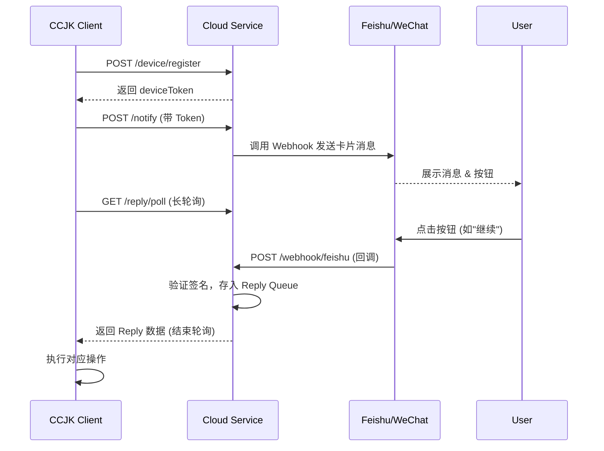

# 后端云服务开发需求文档 (CCJK Cloud Service)

## 1. 项目概述

本文档定义了 **CCJK Cloud Service** 的后端开发需求。该服务旨在为 CCJK (Claude Code Swiss Army Knife) 命令行工具提供云端中继能力，实现**多渠道消息通知**和**用户互动回复**功能。

此后端服务必须与当前的 CCJK 客户端程序 (`src/utils/notification/cloud-client.ts`) 完美兼容。

### 核心价值
- **通知中继**: 将 CLI 的本地任务状态（完成、失败、进度）转发到用户的 IM 软件（飞书、企业微信、钉钉）。
- **远程控制**: 接收用户在 IM 软件中的操作（如“继续任务”、“取消”），并中继回 CLI 客户端。

---

## 2. 架构设计与技术栈

### 推荐技术栈
考虑到服务的轻量级和高并发特点（大量长轮询），推荐使用 Serverless 架构：
- **Runtime**: **Cloudflare Workers** (首选) 或 Node.js (Hono / Fastify)。
- **Language**: TypeScript。
- **Storage**:
  - **Redis / Cloudflare KV**: 用于存储设备会话 (`token` -> `device_info`) 和暂存用户回复 (`reply_queue`)。
  - **RDBMS (可选)**: 如需持久化历史记录，可使用 PostgreSQL。

### 交互流程图


---

## 3. API 接口需求 (必须匹配当前客户端)

后端必须实现以下接口以支持 `src/utils/notification/cloud-client.ts` 的调用。

### 3.1 鉴权机制
- 客户端在 Header 中携带 `X-Device-Token`。
- 后端需验证 Token 有效性（查找 KV/Redis）。

### 3.2 设备管理
- **注册设备**
  - `POST /device/register`
  - **逻辑**: 生成唯一 `token` 和 `deviceId`，保存客户端提交的 `config` (含渠道配置)。
  - **响应**: `{ success: true, data: { token, deviceId, registeredAt } }`

- **获取设备信息**
  - `GET /device/info`
  - **逻辑**: 返回设备的基础信息和最后活跃时间。

- **更新渠道配置**
  - `PUT /device/channels`
  - **逻辑**: 更新该设备绑定的推送渠道配置（如 Webhook URL、密钥等）。由于安全原因，客户端可能仅上传部分非敏感配置，后端需支持配置合并。

### 3.3 通知服务
- **发送通知**
  - `POST /notify`
  - **Payload**: 包含 `title`, `body`, `type`, `task` (详情), `channels` (目标渠道列表), `actions` (按钮定义)。
  - **逻辑**:
    1. 验证 Token。
    2. 读取设备配置中的渠道信息 (Webhook URL 等)。
    3. 根据 `channels` 列表，并行调用第三方 API (飞书/企微/钉钉)。
    4. 针对不同渠道适配消息格式（Markdown / Interactive Card）。

- **测试通知**
  - `POST /notify/test`
  - **逻辑**: 发送一条简单的 "Hello World" 通知，用于验证配置。

### 3.4 回复处理 (核心难点)
- **长轮询回复**
  - `GET /reply/poll`
  - **Timeout**: 客户端默认超时 60s。
  - **逻辑**:
    - 检查 Redis 中是否有该设备的未读回复。
    - **有**: 立即返回 `{ success: true, data: { reply: ... } }`，并从队列移除。
    - **无**: 挂起请求（Async Wait），直到有新回复或超时（约 50-55s 后返回空）。

### 3.5 Webhook 回调 (接收第三方平台数据)
- `POST /webhook/feishu`: 处理飞书卡片交互。
- `POST /webhook/wechat`: 处理企业微信回调。
- `POST /webhook/dingtalk`: 处理钉钉回调。
- **逻辑**:
  1. **签名验证**: 必须验证第三方平台的签名 (Signature/Token)，防止伪造。
  2. **解析**: 提取 `action_id` (用户操作) 和 `task_id`。
  3. **映射**: 根据回调中的用户 ID (OpenID) 找到对应的设备 Token (需在发送通知时维护映射关系，或在回调 URL 中携带 Token 参数)。
  4. **入队**: 将回复对象 `{ taskId, content, actionId }` 存入 Redis 队列，触发挂起的长轮询请求。

---

## 4. 数据模型定义

### Device (Redis Key: `device:{token}`)
```typescript
interface Device {
  deviceId: string;
  name: string;      // e.g., "MacBook Pro"
  platform: string;  // e.g., "darwin"
  config: {
    channels: Array<{
      type: 'feishu' | 'wechat' | 'dingtalk';
      enabled: boolean;
      config: Record<string, any>; // Webhook URLs, Secrets
    }>;
  };
  lastSeen: string; // ISO Date
}
```

### Reply (Redis Key: `reply:{token}`)
这是一个 List 或 Queue 结构。
```typescript
interface UserReply {
  taskId: string;
  content: string;    // 按钮的 Value
  actionId: string;   // 按钮 ID
  channel: string;    // 来源渠道
  timestamp: string;
}
```

---

## 5. 开发阶段与里程碑

### Phase 1: 基础框架与设备注册
- 搭建 Hono + Worker 环境。
- 实现 `/device/register` 和 `/device/info`。
- 实现 Token 生成与 KV 存储。

### Phase 2: 单向通知通道
- 实现 `/notify` 接口。
- 适配 **飞书 (Feishu)** Webhook 发送（最优先）。
- 适配 **企业微信** 和 **钉钉**。

### Phase 3: 双向互动 (Interactive)
- 实现 `/reply/poll` 长轮询机制。
- 实现 `/webhook/feishu` 接收卡片按钮点击。
- 联调：CLI 发起任务 -> 手机收到卡片 -> 点击"继续" -> CLI 收到指令继续运行。

---

## 6. 部署与运维
- **域名**: `api.claudehome.cn` (生产环境) / `dev-api.claudehome.cn` (测试环境)。
- **HTTPS**: 强制开启。
- **CORS**: 允许跨域（CLI 可能在不同网络环境）。
- **日志**: 记录关键的 `Notify` 成功率和 `Webhook` 接收情况。

## 7. 参考资料
- **API 详细文档**: 请参照仓库根目录下的 `CLOUD-SERVICE-API.md` 获取完整的 Request/Response JSON 示例。
- **客户端实现**: `src/utils/notification/cloud-client.ts`。
