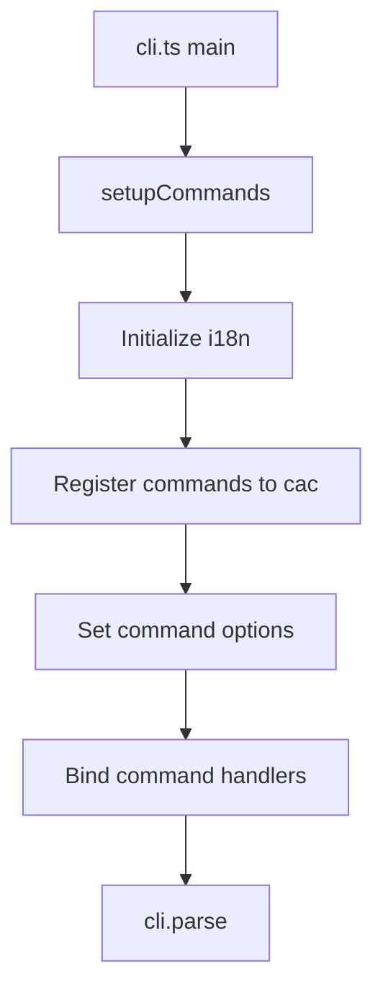
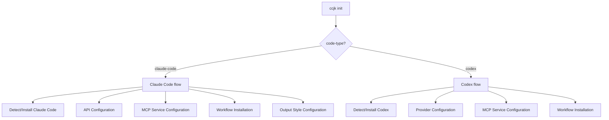
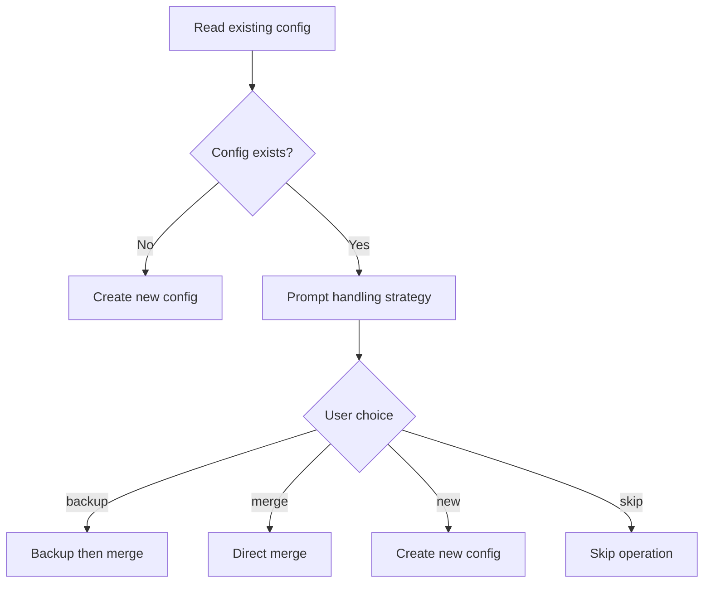
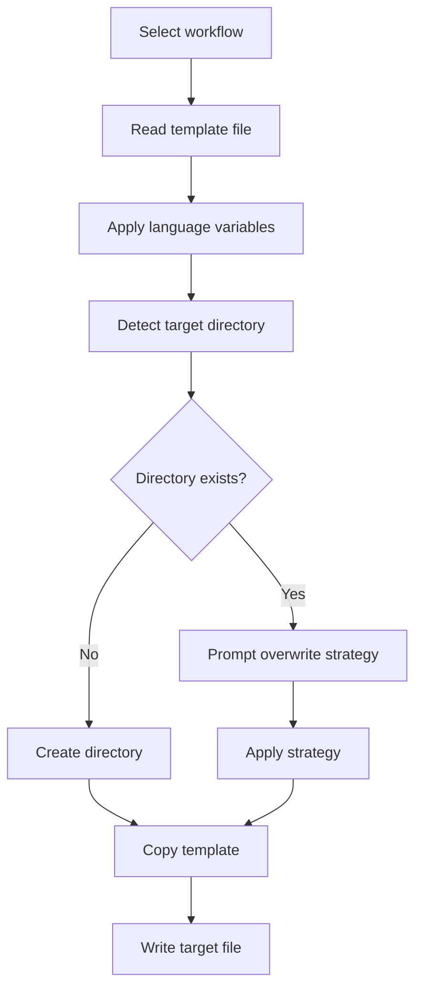

# Architecture Documentation

This document details the architecture design, module organization, key processes, and extension points of the CCJK project, helping developers understand and participate in project development.

## 📋 Table of Contents

- [Technology Stack](#technology-stack)
- [Project Structure](#project-structure)
- [Core Modules](#core-modules)
- [Key Processes](#key-processes)
- [Design Patterns](#design-patterns)
- [Extension Points](#extension-points)

## Technology Stack

### Core Technologies

| Technology | Version | Purpose |
|------|------|------|
| **TypeScript** | Latest | Main development language (ESM-only) |
| **Node.js** | >= 22 | Runtime environment |
| **pnpm** | >= 10.17.1 | Package manager |
| **cac** | Latest | CLI argument parsing |
| **unbuild** | Latest | Build tool (ESM-only output) |
| **Vitest** | Latest | Test framework |
| **i18next** | Latest | Internationalization framework |
| **tsx** | Latest | TypeScript development executor |

### Key Dependencies

- **pathe**: Cross-platform path operations
- **tinyexec**: Cross-platform command execution
- **inquirer**: Interactive CLI prompts
- **ansis**: ANSI colors and styles
- **dayjs**: Date handling

## Project Structure

### Directory Hierarchy

```
ccjk/
├── bin/
│   └── ccjk.mjs              # CLI executable entry
├── src/                     # Source code
│   ├── cli.ts              # CLI main entry (cac initialization)
│   ├── cli-setup.ts        # Command registration and setup
│   ├── constants.ts        # Project constant definitions
│   ├── types.ts            # Global type definitions
│   ├── index.ts            # Module export entry
│   │
│   ├── commands/           # CLI command implementations
│   │   ├── init.ts         # Complete initialization (1200+ lines)
│   │   ├── menu.ts         # Interactive menu
│   │   ├── update.ts       # Workflow updates
│   │   ├── ccr.ts          # CCR management entry
│   │   ├── ccu.ts          # Usage analysis
│   │   ├── check-updates.ts # Version checking
│   │   ├── config-switch.ts # Configuration switching
│   │   └── uninstall.ts    # Uninstall functionality
│   │
│   ├── utils/              # Utility function library
│   │   ├── config.ts       # Configuration management core
│   │   ├── installer.ts    # Claude Code installation
│   │   ├── platform.ts     # Platform detection and adaptation
│   │   ├── workflow-installer.ts # Workflow installation
│   │   ├── mcp-selector.ts # MCP service selection
│   │   ├── output-style.ts # Output style management
│   │   ├── error-handler.ts # Error handling
│   │   │
│   │   ├── ccr/           # CCR integration module
│   │   │   ├── config.ts   # CCR configuration management
│   │   │   ├── installer.ts # CCR installation
│   │   │   ├── commands.ts # CCR command execution
│   │   │   └── presets.ts  # CCR preset configuration
│   │   │
│   │   ├── cometix/       # CCometixLine integration
│   │   │   ├── installer.ts
│   │   │   ├── commands.ts
│   │   │   ├── menu.ts
│   │   │   └── errors.ts
│   │   │
│   │   ├── code-tools/    # Codex integration module
│   │   │   ├── codex.ts   # Codex main logic
│   │   │   ├── codex-configure.ts
│   │   │   ├── codex-config-switch.ts
│   │   │   ├── codex-platform.ts
│   │   │   └── ...
│   │   │
│   │   └── tools/         # Tool integration
│   │       ├── ccr-menu.ts
│   │       └── index.ts
│   │
│   ├── config/            # Configuration definitions
│   │   ├── workflows.ts   # Workflow configuration
│   │   ├── mcp-services.ts # MCP service configuration
│   │   └── api-providers.ts # API provider presets
│   │
│   ├── i18n/              # Internationalization system
│   │   ├── index.ts       # i18next initialization
│   │   └── locales/       # Translation files
│   │       ├── zh-CN/     # Chinese translations
│   │       └── en/        # English translations
│   │
│   └── types/              # TypeScript type definitions
│       ├── workflow.ts
│       ├── config.ts
│       ├── ccr.ts
│       ├── claude-code-config.ts
│       └── toml-config.ts
│
├── templates/             # Configuration templates
│   ├── claude-code/       # Claude Code templates
│   ├── codex/            # Codex templates
│   └── common/           # Shared templates
│       ├── output-styles/  # AI personality styles (en, zh-CN)
│       └── workflow/       # Shared workflows
│           ├── git/        # Git commands (commit, worktree, etc.)
│           └── sixStep/    # Six-stage development workflow
│
├── tests/                 # Test files
│   ├── unit/             # Unit tests
│   ├── integration/      # Integration tests
│   ├── commands/         # Command tests
│   ├── utils/            # Utility function tests
│   └── ...
│
└── dist/                  # Build output (not committed)
```

## Core Modules

### 1. CLI Entry Layer (`src/cli.ts` + `src/cli-setup.ts`)

**Responsibilities**:
- CLI framework initialization (using `cac`)
- Command registration and argument parsing
- i18n system initialization
- Error handling and exit code management

**Key Functions**:
```typescript
// cli.ts
async function main(): Promise<void> {
  const cli = cac('ccjk')
  await setupCommands(cli)
  cli.parse()
}

// cli-setup.ts
export async function setupCommands(cli: CAC): Promise<void>
```

### 2. Command Layer (`src/commands/`)

**Responsibilities**: Implement business logic for each CLI command

**Module Organization**:

| Command | File | Main Function | Complexity |
|------|------|---------|--------|
| `init` | `init.ts` | Complete initialization flow | ⭐⭐⭐⭐⭐ |
| `menu` | `menu.ts` | Interactive menu system | ⭐⭐⭐⭐ |
| `update` | `update.ts` | Workflow and template updates | ⭐⭐⭐ |
| `ccr` | `ccr.ts` | CCR management entry | ⭐⭐ |
| `ccu` | `ccu.ts` | Usage analysis execution | ⭐ |
| `check-updates` | `check-updates.ts` | Tool version checking | ⭐⭐⭐ |
| `config-switch` | `config-switch.ts` | Configuration switching | ⭐⭐⭐⭐ |
| `uninstall` | `uninstall.ts` | Uninstall and cleanup | ⭐⭐⭐⭐ |

### 3. Utility Layer (`src/utils/`)

**Responsibilities**: Provide reusable utility functions and business logic

**Core Modules**:

#### Configuration Management (`config.ts`)
- Configuration reading and writing
- Incremental configuration merging
- Backup creation and restoration

#### Installer (`installer.ts`)
- Claude Code CLI detection and installation
- Cross-platform installation script generation
- Version verification

#### Platform Adaptation (`platform.ts`)
- Operating system detection (Windows/macOS/Linux/Termux)
- Path handling adaptation
- Command execution adaptation

#### Workflow Installer (`workflow-installer.ts`)
- Workflow template selection
- Template copying and customization
- Dependency resolution

### 4. Integration Modules

#### CCR Integration (`src/utils/ccr/`)
- CCR CLI installation and configuration
- Configuration file management
- Preset provider support
- Web UI startup and management

#### Codex Integration (`src/utils/code-tools/`)
- Codex CLI detection and installation
- TOML configuration management
- Provider switching
- Incremental configuration merging

#### CCometixLine Integration (`src/utils/cometix/`)
- Status bar tool installation
- Configuration management
- Error handling

### 5. Internationalization System (`src/i18n/`)

**Architecture**:
- **Framework**: i18next
- **Organization**: Namespace separation
- **Languages**: zh-CN, en
- **Namespaces**: common, cli, menu, errors, api, tools, workflow, uninstall, etc.

**Usage Pattern**:
```typescript
import { i18n } from '../i18n'

// Basic usage
i18n.t('common:success')

// Formatting
format(i18n.t('api:keyRequired'), { field: 'API Key' })
```

### 6. Configuration Definitions (`src/config/`)

**Responsibilities**: Centralized management of system configuration constants

- `workflows.ts`: Workflow definitions and metadata
- `mcp-services.ts`: MCP service configuration and dependencies
- `api-providers.ts`: API provider presets

## Key Processes

### 1. Command Registration Process



### 2. Initialization Process (`init` command)



**Key Steps**:
1. **Environment Detection**: Check Node.js version, tool installation status
2. **Configuration Backup**: Automatically backup existing configuration
3. **Incremental Management**: Detect existing configuration, prompt handling strategy
4. **Configuration Application**: Merge or create new configuration
5. **Verification**: Verify configuration validity

### 3. Configuration Merging Process



### 4. Workflow Installation Process



## Design Patterns

### 1. Command Pattern

Each command is an independent module, registered uniformly through `setupCommands`:

```typescript
// commands/init.ts
export async function init(options: InitOptions): Promise<void>

// cli-setup.ts
cli
  .command('init', 'Initialize Claude Code environment')
  .alias('i')
  .action(async (options) => {
    await init(options)
  })
```

### 2. Strategy Pattern

Configuration handling strategies (backup/merge/new/skip):

```typescript
switch (action) {
  case 'backup':
    await backupExistingConfig()
    await mergeConfig()
    break
  case 'merge':
    await mergeConfig()
    break
  // ...
}
```

### 3. Factory Pattern

Installers for different tool types:

```typescript
// Select installer based on code-type
const installer = codeType === 'codex' 
  ? new CodexInstaller() 
  : new ClaudeCodeInstaller()
```

### 4. Adapter Pattern

Cross-platform path and command adaptation:

```typescript
// platform.ts
export function getConfigPath(): string {
  if (isWindows()) {
    return join(homedir(), 'AppData', 'Local', '.claude')
  }
  return join(homedir(), '.claude')
}
```

## Extension Points

### 1. Add New Command

**Steps**:

1. **Create Command File**:
   ```typescript
   // src/commands/new-command.ts
   export interface NewCommandOptions {
     // Option definitions
   }
   
   export async function newCommand(options: NewCommandOptions): Promise<void> {
     // Implementation logic
   }
   ```

2. **Register Command**:
   ```typescript
   // src/cli-setup.ts
   import { newCommand } from './commands/new-command'
   
   cli
     .command('new-command', 'Description')
     .option('--option', 'Option description')
     .action(async (options) => {
       await newCommand(options)
     })
   ```

3. **Add Tests**: Add test file in `tests/commands/`

4. **Update Documentation**: Update GitBook documentation

### 2. Add New Workflow

**Steps**:

1. **Create Template File**: In `templates/claude-code/workflows/` or `templates/codex/workflows/`
2. **Register Configuration**: Add definition in `src/config/workflows.ts`
3. **Update Installer**: Ensure `workflow-installer.ts` supports new workflow
4. **Add Translations**: Add translations in `src/i18n/locales/`
5. **Test Verification**: Add integration tests

### 3. Add New MCP Service

**Steps**:

1. **Register Service**: Add configuration in `src/config/mcp-services.ts`
2. **Create Template**: Add MCP configuration template in `templates/`
3. **Update Selector**: Ensure `mcp-selector.ts` supports new service
4. **Documentation Update**: Add description in feature documentation

### 4. Add New API Provider Preset

**Steps**:

1. **Add Preset**: Add provider definition in `src/config/api-providers.ts`
2. **Test Verification**: Ensure preset configuration is correct
3. **Documentation Update**: Add in API provider documentation

## Data Flow

### Configuration Reading Process

```
User Input → Command Parsing → Option Validation → Configuration Reading → Business Logic → Configuration Writing → Result Feedback
```

### Error Handling Process

```
Exception Thrown → error-handler Capture → Error Type Judgment → i18n Error Message → User-Friendly Error Prompt
```

## Performance Considerations

1. **Lazy Loading**: Large dependencies loaded on demand
2. **Async Operations**: File operations and command execution use async
3. **Caching Mechanism**: Template reading and configuration parsing result caching
4. **Parallel Execution**: Independent operations execute in parallel

## Security Considerations

1. **API Key Handling**: Sensitive information encrypted storage
2. **Path Validation**: Prevent path traversal attacks
3. **Command Injection Protection**: Use secure command execution methods
4. **Configuration File Permissions**: Set reasonable file permissions

## Related Documentation

- [Contribution Guide](contributing.md) - Detailed guide for participating in development
- [Testing Guide](testing.md) - Test writing and running
- [CLAUDE.md](https://github.com/miounet11/ccjk/blob/main/CLAUDE.md) - Complete project architecture documentation


