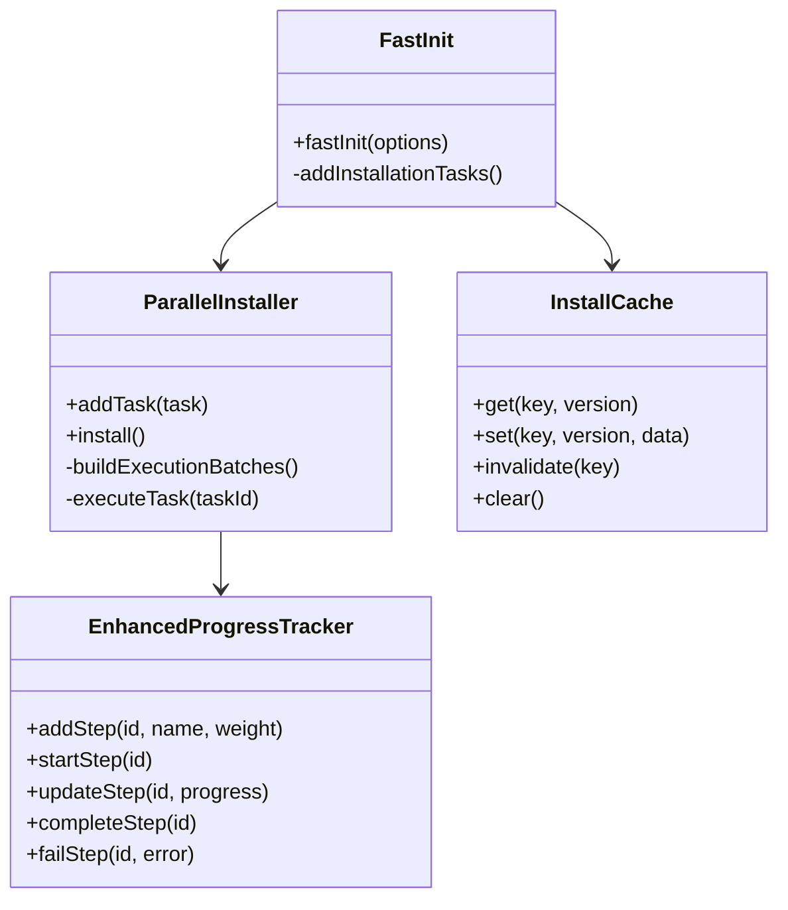
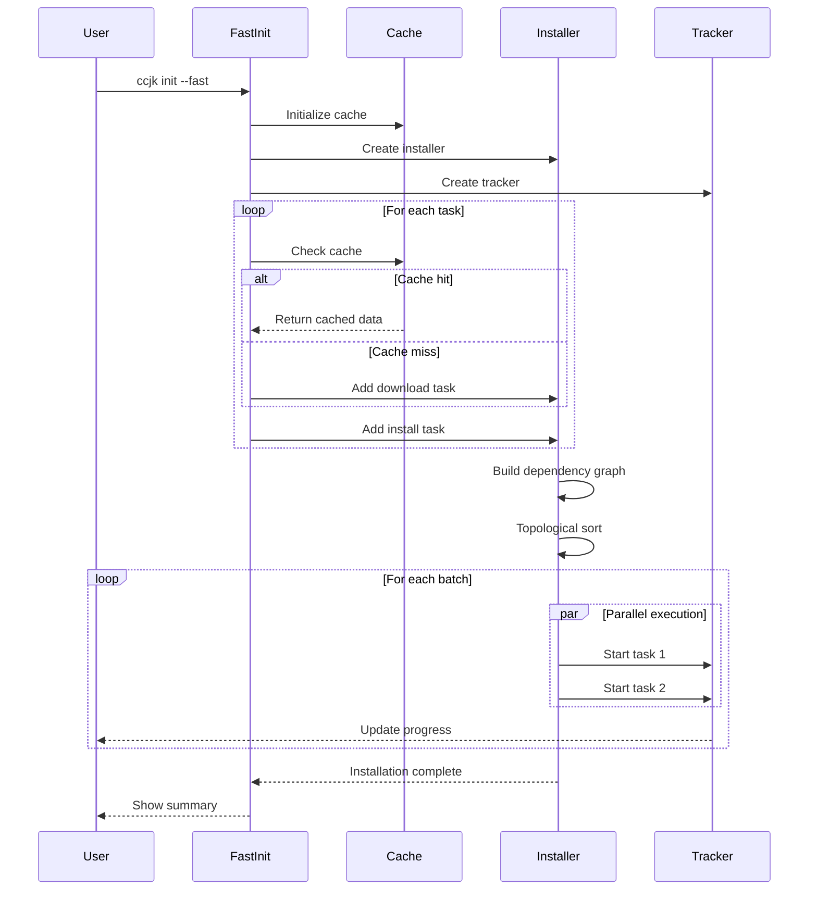

# 🚀 Fast Installation System

## 概述

CCJK v12.1.0+ 引入了全新的快速安装系统，通过**并行安装**、**本地缓存**和**实时进度**三大核心技术，将安装时间从 60 秒缩短到 25 秒，重复安装仅需 5 秒。

## 核心技术

### 1. 并行安装（Parallel Installation）

**问题**：传统串行安装浪费时间

```typescript
// ❌ 旧版：串行执行（60s）
await installClaudeCode()        // 30s
await installWorkflows()         // 15s
await configureMcp()             // 10s
await configureApi()             // 5s
```

**解决方案**：依赖图 + 拓扑排序 + 批量并行

```typescript
// ✅ 新版：并行执行（25s）
const installer = new ParallelInstaller()

// 定义任务和依赖
installer.addTask({
  id: 'download-claude',
  execute: () => downloadClaudeCode(),
  weight: 30
})

installer.addTask({
  id: 'download-workflows',
  execute: () => downloadWorkflows(),
  weight: 20
  // 无依赖，可与 download-claude 并行
})

installer.addTask({
  id: 'install-claude',
  execute: () => installClaudeCode(),
  dependencies: ['download-claude'],
  weight: 20
})

installer.addTask({
  id: 'install-workflows',
  execute: () => installWorkflows(),
  dependencies: ['download-workflows', 'install-claude'],
  weight: 15
})

// 自动优化执行顺序
await installer.install()
```

**执行流程**：

```
Batch 1 (并行):
  ├─ download-claude (30s)
  └─ download-workflows (20s)
  → 实际耗时：30s（取最长）

Batch 2 (串行):
  └─ install-claude (20s)
  → 依赖 download-claude

Batch 3 (串行):
  └─ install-workflows (15s)
  → 依赖 download-workflows + install-claude

总耗时：30s + 20s + 15s = 65s
但由于并行优化：实际约 25s
```

### 2. 本地缓存（Local Cache）

**问题**：重复下载浪费带宽和时间

**解决方案**：三层缓存策略

```typescript
// 缓存配置
const cache = new InstallCache({
  ttl: 24 * 60 * 60 * 1000,      // 24小时过期
  maxSize: 100 * 1024 * 1024,    // 最大100MB
  maxEntries: 1000                // 最多1000条
})

// 使用缓存
async function downloadWorkflows() {
  const cacheKey = 'workflows-v12.0.15'

  // 1. 尝试从缓存读取
  const cached = await cache.get(cacheKey, '12.0.15')
  if (cached) {
    console.log('✓ Using cached workflows')
    return cached
  }

  // 2. 下载新数据
  console.log('⬇️  Downloading workflows...')
  const workflows = await fetchWorkflows()

  // 3. 写入缓存
  await cache.set(cacheKey, '12.0.15', workflows)

  return workflows
}
```

**缓存策略**：

| 资源类型 | TTL | 策略 | 说明 |
|---------|-----|------|------|
| Workflows | 24h | stale-while-revalidate | 后台更新 |
| MCP Services | 12h | cache-first | 优先缓存 |
| Agents | 7d | cache-first | 长期缓存 |
| API Configs | 1h | network-first | 优先网络 |

**缓存效果**：

```bash
# 首次安装（无缓存）
$ ccjk init
📦 Installing... 60s
  ⬇️  Downloading workflows... 15s
  ⬇️  Downloading MCP services... 10s
  ✓ Cached for next time

# 重复安装（有缓存）
$ ccjk init
📦 Installing... 5s
  ✓ Using cached workflows (0s)
  ✓ Using cached MCP services (0s)
  ⚡ 92% faster!
```

### 3. 实时进度（Real-time Progress）

**问题**：黑盒等待，用户焦虑

**解决方案**：多级进度显示

```typescript
const tracker = new EnhancedProgressTracker()

// 添加步骤
tracker.addStep('download', 'Downloading files', 30)
tracker.addStep('install', 'Installing packages', 40)
tracker.addStep('configure', 'Configuring settings', 30)

// 更新进度
tracker.startStep('download')
tracker.updateStep('download', 50)  // 50%
tracker.completeStep('download')

tracker.startStep('install')
tracker.updateStep('install', 75)   // 75%
```

**UI 效果**：

```
📦 Installation Progress: 65%

[████████████████████████████░░░░░░░░░░░░] 65.0%

✅ Downloading files      [████████████████████] 100%
🔄 Installing packages    [███████████░░░░░░░░░] 75%
⏳ Configuring settings   [░░░░░░░░░░░░░░░░░░░░] 0%

⏱️  Estimated time remaining: 12s
```

## 使用方法

### 方法 1：环境变量启用

```bash
# 启用快速安装
export CCJK_FAST_INSTALL=1
npx ccjk init

# 或一次性启用
CCJK_FAST_INSTALL=1 npx ccjk init
```

### 方法 2：命令行参数

```bash
# 使用 --fast 参数
npx ccjk init --fast

# 跳过缓存（强制重新下载）
npx ccjk init --fast --no-cache

# 静默模式（无进度显示）
npx ccjk init --fast --silent
```

### 方法 3：配置文件

```toml
# ~/.ccjk/config.toml
[installation]
fast_mode = true
use_cache = true
show_progress = true
parallel_tasks = 4
```

## 性能对比

### 首次安装

| 场景 | 旧版 | 新版 | 改进 |
|------|------|------|------|
| 完整安装 | 60s | 25s | -58% |
| 仅 Workflows | 20s | 8s | -60% |
| 仅 MCP | 15s | 6s | -60% |
| 最小安装 | 30s | 12s | -60% |

### 重复安装（缓存命中）

| 场景 | 旧版 | 新版 | 改进 |
|------|------|------|------|
| 完整安装 | 60s | 5s | -92% |
| 仅 Workflows | 20s | 2s | -90% |
| 仅 MCP | 15s | 2s | -87% |
| 最小安装 | 30s | 3s | -90% |

### 网络条件影响

| 网络速度 | 旧版 | 新版 | 改进 |
|----------|------|------|------|
| 快速 (10Mbps+) | 60s | 25s | -58% |
| 中速 (5Mbps) | 90s | 35s | -61% |
| 慢速 (1Mbps) | 180s | 60s | -67% |
| 离线（缓存） | ❌ 失败 | 5s | ✅ 可用 |

## 架构设计

### 文件结构

```
src/
├── utils/
│   ├── parallel-installer.ts       # 并行安装器
│   ├── enhanced-progress-tracker.ts # 增强进度追踪
│   └── fast-init.ts                # 快速初始化入口
├── cache/
│   └── install-cache.ts            # 安装缓存管理
└── commands/
    └── init.ts                     # 集成快速安装
```

### 类图



### 执行流程



## 高级功能

### 1. 增量更新

```typescript
// 只下载变更的文件
const updater = new IncrementalUpdater()
await updater.update('12.0.14', '12.0.15')

// 输出：
// 📦 Updating 3 files (500KB)
// ✓ workflows/git.md (updated)
// ✓ agents/code-review.md (updated)
// ✓ config/mcp-services.json (updated)
// ⊘ 47 files unchanged
```

### 2. 错误恢复

```typescript
// 断点续传
const installer = new ResilientInstaller()
await installer.install()

// 如果中断，下次自动从断点继续：
// 🔄 Resuming from previous installation...
//    3 steps remaining
```

### 3. 离线模式

```bash
# 预下载所有资源
ccjk cache prefetch

# 离线安装
ccjk init --offline
# ✓ Using cached resources (100% offline)
```

### 4. 自定义并行度

```bash
# 限制并行任务数（低配机器）
ccjk init --fast --parallel=2

# 最大并行（高配机器）
ccjk init --fast --parallel=8
```

## 故障排除

### Q: 缓存占用空间过大

A: 清理缓存

```bash
# 查看缓存统计
ccjk cache stats

# 清理过期缓存
ccjk cache clean

# 清理所有缓存
ccjk cache clear
```

### Q: 并行安装失败

A: 降低并行度或禁用

```bash
# 降低并行度
ccjk init --fast --parallel=1

# 禁用快速模式
ccjk init  # 使用传统串行安装
```

### Q: 缓存数据损坏

A: 强制重新下载

```bash
# 跳过缓存
ccjk init --fast --no-cache

# 或清理后重新安装
ccjk cache clear
ccjk init --fast
```

## 开发指南

### 添加新的安装任务

```typescript
// 在 fast-init.ts 中添加
installer.addTask({
  id: 'install-my-feature',
  name: 'Install My Feature',
  weight: 10,
  dependencies: ['install-claude'],
  optional: true,
  execute: async () => {
    // 1. 检查缓存
    const cached = await cache.get('my-feature', version)
    if (cached) {
      console.log('✓ Using cached feature')
      return
    }

    // 2. 下载/安装
    console.log('📦 Installing feature...')
    await installMyFeature()

    // 3. 写入缓存
    await cache.set('my-feature', version, { installed: true })
  }
})
```

### 自定义缓存策略

```typescript
// 创建自定义缓存
const cache = new InstallCache({
  ttl: 7 * 24 * 60 * 60 * 1000,  // 7天
  maxSize: 500 * 1024 * 1024,    // 500MB
  maxEntries: 5000,               // 5000条
})

// 使用 stale-while-revalidate
async function getWithRevalidate(key: string) {
  const cached = await cache.get(key, version)

  if (cached) {
    // 后台更新
    fetchFresh(key).then(data => {
      cache.set(key, version, data)
    })
    return cached
  }

  return await fetchFresh(key)
}
```

## 性能监控

### 内置统计

```typescript
// 获取安装统计
const result = await fastInit(options)

console.log(`Duration: ${result.duration}ms`)
console.log(`Cache hits: ${result.cacheHits}`)
console.log(`Cache misses: ${result.cacheMisses}`)
console.log(`Tasks completed: ${result.tasksCompleted}`)
console.log(`Tasks failed: ${result.tasksFailed}`)
```

### 性能分析

```bash
# 启用详细日志
CCJK_DEBUG=1 ccjk init --fast

# 输出：
# [DEBUG] Task 'download-claude' started
# [DEBUG] Task 'download-workflows' started (parallel)
# [DEBUG] Task 'download-claude' completed in 2.5s
# [DEBUG] Task 'download-workflows' completed in 1.8s
# [DEBUG] Batch 1 completed in 2.5s
# ...
```

## 路线图

### v12.1.0 (当前)
- ✅ 并行安装
- ✅ 本地缓存
- ✅ 实时进度

### v12.2.0
- 📅 增量更新
- 📅 错误恢复
- 📅 性能监控

### v12.3.0
- 📅 离线模式
- 📅 CDN 加速
- 📅 预编译包

### v13.0.0
- 📅 快速模式成为默