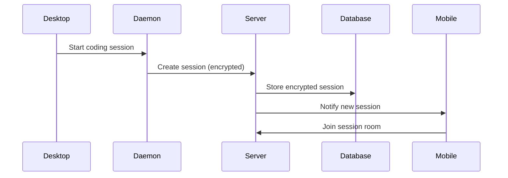
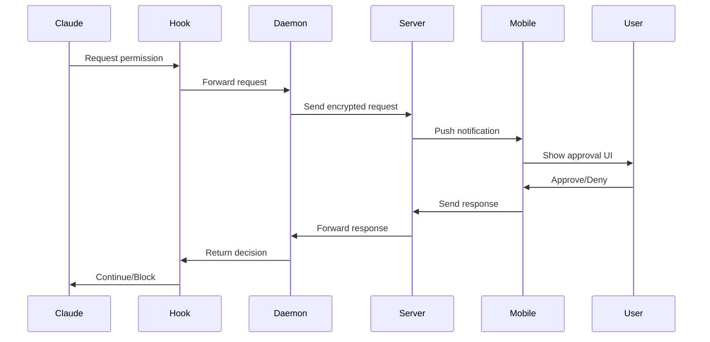
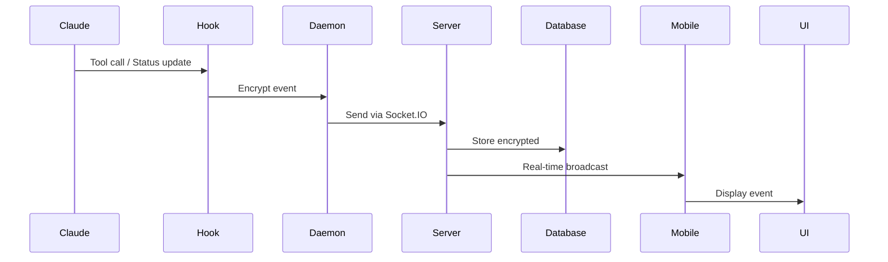

# CCJK Remote Control - Complete Implementation Guide

**Version**: 11.0.0
**Last Updated**: 2026-02-21
**Status**: Production Ready

---

## 📚 Table of Contents

1. [Architecture Overview](#architecture-overview)
2. [Server Setup](#server-setup)
3. [Mobile App Setup](#mobile-app-setup)
4. [Desktop Client Setup](#desktop-client-setup)
5. [Development Workflow](#development-workflow)
6. [Deployment](#deployment)
7. [Troubleshooting](#troubleshooting)

---

## 🏗️ Architecture Overview

### System Components

```
┌─────────────────────────────────────────────────────────────────┐
│                     CCJK Remote Control v11                      │
└─────────────────────────────────────────────────────────────────┘

┌──────────────┐         ┌──────────────┐         ┌──────────────┐
│   Desktop    │         │    Server    │         │   Mobile     │
│              │         │              │         │              │
│  Claude Code │         │  Fastify +   │         │  Expo App    │
│      ↓       │         │  Socket.IO   │         │              │
│  Brain Hook  │◄───────►│      +       │◄───────►│  React       │
│      ↓       │ Encrypt │  PostgreSQL  │ Decrypt │  Native      │
│   Daemon     │         │      +       │         │              │
│  (Socket.IO) │         │    Redis     │         │              │
└──────────────┘         └──────────────┘         └──────────────┘
       │                        │                        │
       │                        │                        │
    Lock File              Encrypted                Push Notif
  ~/.ccjk/daemon.lock      Storage                 (Expo Push)
```

### Data Flow

#### 1. Session Creation


#### 2. Permission Request


#### 3. Real-time Events


---

## 🖥️ Server Setup

### Prerequisites

- Node.js 20+
- PostgreSQL 16+
- Redis 7+ (optional, for scaling)
- pnpm 10+

### Quick Start (Development)

```bash
# 1. Navigate to server package
cd packages/ccjk-server

# 2. Install dependencies
pnpm install

# 3. Setup environment
cp .env.example .env

# Edit .env:
# - DATABASE_URL
# - JWT_SECRET
# - GITHUB_CLIENT_ID
# - GITHUB_CLIENT_SECRET
# - EXPO_ACCESS_TOKEN (optional)

# 4. Start PostgreSQL (Docker)
docker run -d \
  --name ccjk-postgres \
  -e POSTGRES_USER=ccjk \
  -e POSTGRES_PASSWORD=ccjk_password \
  -e POSTGRES_DB=ccjk \
  -p 5432:5432 \
  postgres:16-alpine

# 5. Generate Prisma client
pnpm db:generate

# 6. Run migrations
pnpm db:migrate

# 7. Start dev server
pnpm dev
```

Server will be running at `http://localhost:3005`

### Production Deployment

#### Option 1: Docker Compose (Recommended)

```bash
# 1. Create .env file
cp .env.example .env
# Edit with production values

# 2. Start all services
docker-compose up -d

# 3. Run migrations
docker-compose exec server pnpm db:migrate

# 4. Check logs
docker-compose logs -f server
```

#### Option 2: Railway

1. Create project on [Railway](https://railway.app)
2. Add PostgreSQL service
3. Deploy from GitHub
4. Set environment variables
5. Run migrations: `railway run pnpm db:migrate`

#### Option 3: Render

1. Create Web Service on [Render](https://render.com)
2. Configure:
   - Build: `cd packages/ccjk-server && pnpm install && pnpm db:generate`
   - Start: `cd packages/ccjk-server && pnpm start`
3. Add PostgreSQL database
4. Set environment variables
5. Run migrations via Render Shell

### GitHub OAuth Setup

1. Go to https://github.com/settings/developers
2. Click "New OAuth App"
3. Fill in:
   - Name: `CCJK Remote`
   - Homepage: `https://your-domain.com`
   - Callback: `https://your-domain.com/auth/github/callback`
4. Copy Client ID and Secret
5. Update `.env`:
   ```env
   GITHUB_CLIENT_ID=your_client_id
   GITHUB_CLIENT_SECRET=your_client_secret
   GITHUB_CALLBACK_URL=https://your-domain.com/auth/github/callback
   ```

### API Endpoints

#### Authentication
- `GET /auth/github` - Start GitHub OAuth
- `GET /auth/github/callback` - OAuth callback
- `POST /auth/mobile` - Mobile authentication
- `GET /auth/verify` - Verify token

#### Sessions
- `GET /v1/sessions` - List sessions
- `GET /v1/sessions/:id` - Get session
- `POST /v1/sessions` - Create session
- `PATCH /v1/sessions/:id` - Update session
- `DELETE /v1/sessions/:id` - Delete session
- `GET /v1/sessions/:id/messages` - Get messages

#### Machines
- `GET /v1/machines` - List machines
- `GET /v1/machines/:id` - Get machine
- `POST /v1/machines` - Register machine
- `PATCH /v1/machines/:id` - Update machine
- `DELETE /v1/machines/:id` - Delete machine

#### Socket.IO Events
- `session:join` - Join session room
- `session:leave` - Leave session room
- `session:event` - Session event (daemon → server → mobile)
- `remote:command` - Remote command (mobile → server → daemon)
- `approval:response` - Permission approval

---

## 📱 Mobile App Setup

### Prerequisites

- Node.js 20+
- Expo CLI
- iOS Simulator (Mac) or Android Emulator
- Expo Go app (for testing on device)

### Development

```bash
# 1. Navigate to app package
cd packages/ccjk-app

# 2. Install dependencies
pnpm install

# 3. Create .env file
cat > .env << EOF
EXPO_PUBLIC_API_URL=http://localhost:3005
EXPO_PUBLIC_GITHUB_CLIENT_ID=your_github_client_id
EOF

# 4. Start Expo dev server
pnpm start

# 5. Run on platform
pnpm ios      # iOS Simulator
pnpm android  # Android Emulator
pnpm web      # Web browser
```

### Building for Production

#### iOS

```bash
# 1. Install EAS CLI
npm install -g eas-cli

# 2. Login to Expo
eas login

# 3. Configure project
eas build:configure

# 4. Build for iOS
eas build --platform ios

# 5. Submit to App Store
eas submit --platform ios
```

#### Android

```bash
# 1. Build for Android
eas build --platform android

# 2. Submit to Google Play
eas submit --platform android
```

### App Structure

```
packages/ccjk-app/
├── app/                    # Expo Router pages
│   ├── _layout.tsx        # Root layout
│   ├── index.tsx          # Home/Landing
│   ├── auth.tsx           # Authentication
│   ├── sessions.tsx       # Sessions list
│   └── session/
│       └── [id].tsx       # Session detail
├── src/
│   ├── api/               # API clients
│   │   ├── client.ts      # REST API
│   │   └── socket.ts      # Socket.IO
│   ├── store/             # Zustand stores
│   │   ├── auth.ts        # Auth state
│   │   └── sessions.ts    # Sessions state
│   └── config.ts          # App config
└── app.json               # Expo config
```

### Key Features

#### 1. Authentication
- GitHub OAuth via WebBrowser
- Token storage with AsyncStorage
- Auto token verification on launch

#### 2. Session List
- Real-time session updates
- Pull-to-refresh
- Active/inactive indicators

#### 3. Session Detail
- Real-time message stream
- Permission approval UI
- Encrypted message display

#### 4. Push Notifications
- Permission request alerts
- Session error notifications
- Background updates

---

## 💻 Desktop Client Setup

### Prerequisites

- CCJK CLI installed
- Claude Code or other supported code tool

### Enable Remote Control

```bash
# 1. Enable remote control
ccjk remote enable

# Enter server URL when prompted:
# - Development: http://localhost:3005
# - Production: https://your-domain.com

# 2. Get pairing QR code
ccjk remote qr

# 3. Scan QR code with mobile app

# 4. Start daemon
ccjk daemon start

# 5. Verify daemon is running
ccjk daemon status
```

### Daemon Commands

```bash
# Start daemon
ccjk daemon start

# Stop daemon
ccjk daemon stop

# Check status
ccjk daemon status

# View logs
tail -f ~/.ccjk/daemon.log
```

### Configuration

Daemon config is stored at `~/.ccjk/daemon.json`:

```json
{
  "enabled": true,
  "serverUrl": "https://your-domain.com",
  "machineId": "machine-xxx",
  "authToken": "your-token"
}
```

### Troubleshooting

#### Daemon won't start
```bash
# Check if already running
ccjk daemon status

# Check lock file
cat ~/.ccjk/daemon.lock

# Remove stale lock
rm ~/.ccjk/daemon.lock

# Try again
ccjk daemon start
```

#### Can't connect to server
```bash
# Test server connection
curl https://your-domain.com/health

# Check daemon logs
tail -f ~/.ccjk/daemon.log

# Verify server URL
cat ~/.ccjk/daemon.json
```

---

## 🔧 Development Workflow

### Full Stack Development

```bash
# Terminal 1: Server
cd packages/ccjk-server
pnpm dev

# Terminal 2: Mobile App
cd packages/ccjk-app
pnpm start

# Terminal 3: Daemon (after building)
cd packages/ccjk-daemon
pnpm build
node bin/daemon.mjs start

# Terminal 4: Main CLI
ccjk
```

### Testing Flow

1. **Start server** (Terminal 1)
2. **Start mobile app** (Terminal 2)
3. **Authenticate** in mobile app
4. **Enable remote** on desktop: `ccjk remote enable`
5. **Start daemon**: `ccjk daemon start`
6. **Start coding**: `ccjk`
7. **Watch events** appear in mobile app
8. **Test permission** approval from mobile

### Database Management

```bash
# View database
cd packages/ccjk-server
px prisma studio

# Create migration
pnpm db:migrate

# Reset database (⚠️ destructive)
prisma migrate reset

# Seed database
prisma db seed
```

---

## 🚀 Deployment

### Production Checklist

#### Server
- [ ] Set strong JWT_SECRET
- [ ] Configure CORS properly
- [ ] Enable HTTPS
- [ ] Setup database backups
- [ ] Configure Redis for scaling
- [ ] Setup monitoring (Sentry, etc.)
- [ ] Enable rate limiting
- [ ] Setup log aggregation

#### Mobile App
- [ ] Update API_URL to production
- [ ] Configure GitHub OAuth callback
- [ ] Setup Expo Push Notifications
- [ ] Test on real devices
- [ ] Submit to App Store / Google Play
- [ ] Setup crash reporting

#### Desktop Client
- [ ] Update default server URL
- [ ] Test daemon auto-start
- [ ] Verify encryption
- [ ] Test reconnection logic

### Monitoring

#### Health Checks

```bash
# Server health
curl https://your-domain.com/health

# Database connection
psql $DATABASE_URL -c "SELECT 1"

# Redis connection
redis-cli -u $REDIS_URL ping
```

#### Metrics to Track

- Active sessions
- Connected daemons
- Mobile app DAU
- Permission approval rate
- Average latency
- Error rate
- Database size

---

## 🐛 Troubleshooting

### Common Issues

#### 1. Socket.IO not connecting

**Symptoms**: Mobile app shows "disconnected"

**Solutions**:
```bash
# Check server CORS
# Ensure CORS_ORIGIN includes mobile app domain

# Test WebSocket
wscat -c wss://your-domain.com/socket.io/?EIO=4&transport=websocket

# Check firewall
# Ensure port 3005 is open
```

#### 2. Push notifications not working

**Symptoms**: No notifications on mobile

**Solutions**:
```bash
# Verify Expo token
curl -H "Authorization: Bearer $EXPO_ACCESS_TOKEN" \
  https://exp.host/--/api/v2/push/getReceipts

# Check device token format
# Must be: ExponentPushToken[xxxxxxxxxxxxxxxxxxxxxx]

# Test notification
curl -X POST https://your-domain.com/test-push \
  -H "Authorization: Bearer $TOKEN"
```

#### 3. Daemon crashes

**Symptoms**: Daemon stops unexpectedly

**Solutions**:
```bash
# Check logs
tail -f ~/.ccjk/daemon.log

# Check memory usage
ps aux | grep daemon

# Restart daemon
ccjk daemon stop
ccjk daemon start
```

#### 4. Database connection failed

**Symptoms**: Server won't start

**Solutions**:
```bash
# Check DATABASE_URL
echo $DATABASE_URL

# Test connection
pg_isready -h localhost -p 5432

# Check Prisma client
cd packages/ccjk-server
pnpm db:generate
```

---

## 📊 Performance Optimization

### Server

```typescript
// Enable Redis adapter for horizontal scaling
import { createAdapter } from '@socket.io/redis-adapter';
import { createClient } from 'redis';

const pubClient = createClient({ url: CONFIG.redisUrl });
const subClient = pubClient.duplicate();

await Promise.all([pubClient.connect(), subClient.connect()]);

io.adapter(createAdapter(pubClient, subClient));
```

### Database

```sql
-- Add indexes for common queries
CREATE INDEX idx_sessions_user_active ON "Session"("userId", "active");
CREATE INDEX idx_messages_session_seq ON "Message"("sessionId", "seq");
CREATE INDEX idx_machines_user_active ON "Machine"("userId", "active");

-- Partition messages table by date
CREATE TABLE messages_2026_02 PARTITION OF "Message"
  FOR VALUES FROM ('2026-02-01') TO ('2026-03-01');
```

### Mobile App

```typescript
// Use React.memo for expensive components
const SessionCard = React.memo(({ session }) => {
  // ...
});

// Virtualize long lists
import { FlashList } from '@shopify/flash-list';

// Debounce search
const debouncedSearch = useMemo(
  () => debounce(search, 300),
  []
);
```

---

## 🔐 Security Best Practices

### Encryption

- All messages encrypted client-side
- Server never has access to encryption keys
- Per-session random keys
- TweetNaCl for crypto operations

### Authentication

- JWT tokens with expiration
- GitHub OAuth for identity
- Token refresh mechanism
- Secure token storage (AsyncStorage)

### Network

- HTTPS only in production
- WebSocket over TLS
- CORS properly configured
- Rate limiting enabled

### Database

- Encrypted at rest
- Regular backups
- Parameterized queries (Prisma)
- No sensitive data in logs

---

## 📚 Additional Resources

- [RFC 0011: Remote Control](./rfcs/0011-remote-control.md)
- [Server Deployment Guide](../packages/ccjk-server/DEPLOYMENT.md)
- [API Documentation](./api-reference.md)
- [GitHub Issues](https://github.com/miounet11/ccjk/issues)
- [Discord Community](https://discord.gg/ccjk)

---

**Last Updated**: 2026-02-21
**Version**: 11.0.0
**Status**: ✅ Production Ready
