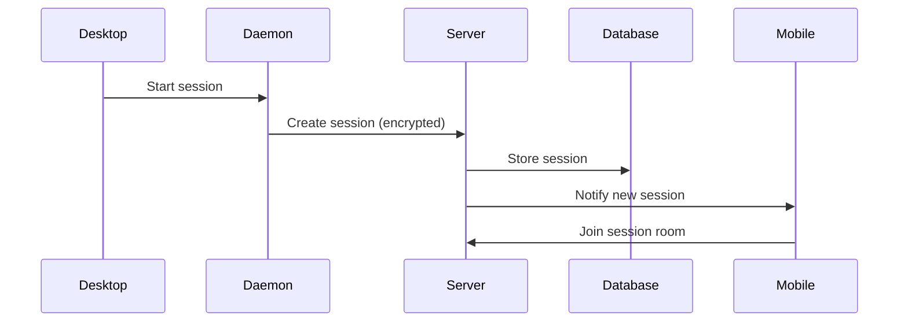
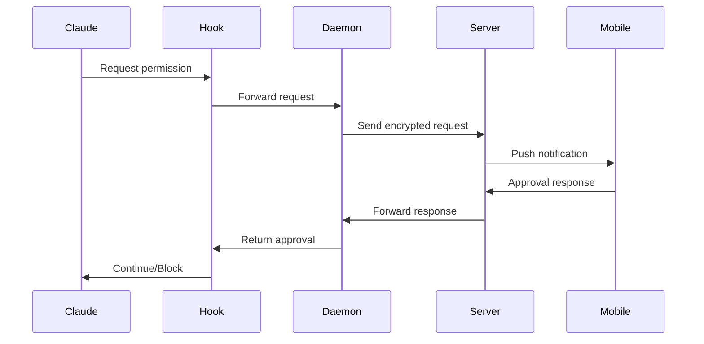
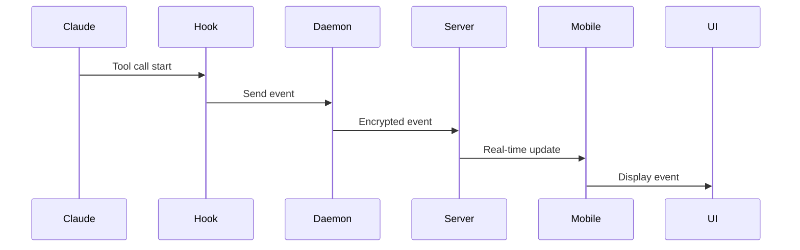

# RFC 0011: Remote Control System

**Status**: Implemented
**Author**: CCJK Team
**Created**: 2026-02-21
**Updated**: 2026-02-21

---

## Summary

Implement a comprehensive remote control system for CCJK, enabling users to monitor and control AI coding sessions from mobile devices and web browsers. Inspired by [Happy Coder](https://github.com/slopus/happy) but with CCJK-specific enhancements.

## Motivation

### Problem

1. **No mobile monitoring**: Users cannot check AI progress while away from desk
2. **Permission bottlenecks**: AI waits for permission approval, blocking progress
3. **No cross-device workflow**: Cannot seamlessly switch between desktop and mobile
4. **Limited visibility**: No real-time insights into AI agent activities

### Goals

- Monitor AI coding sessions from anywhere
- Approve/deny permissions remotely
- Receive push notifications for important events
- Maintain end-to-end encryption
- Support self-hosting

## Design

### Architecture

```
┌─────────────┐         ┌─────────────┐         ┌─────────────┐
│   Desktop   │         │   Server    │         │   Mobile    │
│  (Daemon)   │◄───────►│  (Socket)   │◄───────►│    (App)    │
└─────────────┘         └─────────────┘         └─────────────┘
      │                       │                       │
      │                       │                       │
   Encrypt                 Store                  Decrypt
   Events                Encrypted                Events
                          Messages
```

### Components

#### 1. @ccjk/wire (Protocol Layer)

**Purpose**: Shared message types and encryption

**Key Features**:
- Zod schemas for type safety
- TweetNaCl encryption
- Event types: text, tool-call, permission-request, status, health-score, brain-agent, mcp-service

**Example**:
```typescript
import { createEnvelope } from '@ccjk/wire';

const event = createEnvelope('agent', 'session-123', {
  t: 'permission-request',
  requestId: 'req-456',
  tool: 'Write',
  pattern: '/src/**/*.ts',
});
```

#### 2. @ccjk/daemon (Background Process)

**Purpose**: Local daemon for session management

**Key Features**:
- Process lock (single instance)
- Socket.IO client
- Local control server (HTTP)
- Session handlers

**Commands**:
```bash
ccjk-daemon start   # Start daemon
ccjk-daemon stop    # Stop daemon
ccjk-daemon status  # Check status
```

#### 3. @ccjk/server (Cloud Backend)

**Purpose**: Real-time message relay and storage

**Key Features**:
- Fastify + Socket.IO
- PostgreSQL (encrypted storage)
- Redis (optional scaling)
- GitHub OAuth
- Expo Push Notifications

**Deployment**:
```bash
docker run -p 3005:3005 ccjk-server
```

#### 4. @ccjk/app (Mobile/Web)

**Purpose**: Cross-platform monitoring app

**Key Features**:
- Expo (iOS/Android/Web)
- Real-time session monitoring
- Permission approval UI
- Push notifications

**Screens**:
- Auth (GitHub OAuth)
- Sessions (list)
- Session Detail (real-time)
- Permissions (approve/deny)

#### 5. Brain Hook Integration

**Purpose**: Intercept Claude Code events

**Key Features**:
- Hook registry system
- Event interception
- Remote approval waiting

**Example**:
```typescript
import { hookRegistry } from '@/brain/hooks';
import { remoteSyncHook } from '@/brain/hooks/remote-sync';

hookRegistry.register('permission-request', {
  name: 'remote-sync',
  fn: remoteSyncHook,
  priority: 100,
});
```

### Security

#### End-to-End Encryption

1. **Key Generation**:
   - User generates key pair on first setup
   - Public key stored on server
   - Private key never leaves device

2. **Session Keys**:
   - Each session gets random AES-256 key
   - Session key encrypted with public key
   - Server cannot decrypt content

3. **Message Flow**:
   ```
   Desktop: Encrypt(event, sessionKey) → Server: Store(encrypted) → Mobile: Decrypt(encrypted, sessionKey)
   ```

#### Authentication

- GitHub OAuth for user identity
- JWT tokens for API access
- Machine ID for daemon identification

### Data Flow

#### 1. Session Start



#### 2. Permission Request



#### 3. Real-time Events



## Implementation

### Phase 1: Protocol & Daemon ✅

- [x] Create @ccjk/wire package
- [x] Define Zod schemas
- [x] Implement encryption
- [x] Create @ccjk/daemon package
- [x] Process management
- [x] Socket.IO client
- [x] Control server

### Phase 2: Brain Integration ✅

- [x] Hook system
- [x] Remote sync hook
- [x] Daemon client
- [x] Event interception

### Phase 3: Server & App ✅

- [x] Create @ccjk/server package
- [x] Basic Socket.IO server
- [x] Create @ccjk/app package
- [x] Expo project setup

### Phase 4: CLI Integration ✅

- [x] `ccjk remote enable/disable`
- [x] `ccjk remote status`
- [x] `ccjk remote qr`
- [x] `ccjk daemon start/stop/status`
- [x] i18n translations

### Phase 5: Documentation ✅

- [x] RFC document
- [x] Package READMEs
- [x] Architecture diagrams

## Usage

### Setup

```bash
# 1. Enable remote control
ccjk remote enable

# 2. Get pairing QR code
ccjk remote qr

# 3. Scan with mobile app
# (Download from App Store / Google Play)

# 4. Start daemon
ccjk daemon start

# 5. Start coding!
ccjk
```

### Self-Hosting

```bash
# Clone server
git clone https://github.com/miounet11/ccjk.git
cd ccjk/packages/ccjk-server

# Setup environment
cp .env.example .env
# Edit .env with your settings

# Start with Docker
docker-compose up -d

# Or run directly
pnpm install
pnpm db:migrate
pnpm start
```

### Mobile App

```bash
# Development
cd packages/ccjk-app
pnpm install
pnpm start

# Build
eas build --platform ios
eas build --platform android
```

## Comparison with Happy

| Feature | Happy | CCJK Remote |
|---------|-------|-------------|
| **Protocol** | Custom | Zod + TypeScript |
| **Encryption** | TweetNaCl | TweetNaCl |
| **Backend** | Fastify + Socket.IO | Fastify + Socket.IO |
| **Mobile** | Expo | Expo |
| **Code Tools** | Claude Code, Codex | Claude Code, Codex, Aider, Continue, Cline, Cursor |
| **Brain System** | ❌ | ✅ Multi-agent orchestration |
| **Health Score** | ❌ | ✅ Real-time scoring |
| **MCP Integration** | ❌ | ✅ One-click install |
| **Self-Hosting** | ✅ | ✅ Docker + docs |
| **Push Notifications** | ✅ | ✅ Expo Push |

## Future Enhancements

### v11.1
- [ ] Voice commands ("Approve all permissions")
- [ ] Session recording/replay
- [ ] Collaborative sessions (multiple users)
- [ ] Advanced analytics dashboard

### v11.2
- [ ] WebRTC for lower latency
- [ ] Offline mode with sync
- [ ] Custom notification rules
- [ ] Integration with Slack/Discord

### v11.3
- [ ] AI-powered permission suggestions
- [ ] Automatic session summaries
- [ ] Cost tracking and optimization
- [ ] Team management features

## Risks & Mitigations

| Risk | Impact | Mitigation |
|------|--------|------------|
| Encryption bugs | High | Security audit, extensive testing |
| Server downtime | Medium | Self-hosting option, offline mode |
| Mobile app rejection | Medium | Follow platform guidelines |
| Performance issues | Low | Compression, pagination, caching |
| User adoption | Low | Clear docs, smooth onboarding |

## Success Metrics

### 3 Months
- 20% of CCJK users enable remote
- Mobile app DAU > 500
- Average latency < 500ms
- 0 security incidents

### 6 Months
- 50% of CCJK users enable remote
- App Store rating > 4.5
- 100+ self-hosted instances
- 50+ community MCP services

## References

- [Happy Coder](https://github.com/slopus/happy) - Inspiration
- [Socket.IO](https://socket.io/) - Real-time engine
- [TweetNaCl](https://tweetnacl.js.org/) - Encryption
- [Expo](https://expo.dev/) - Mobile framework
- [Prisma](https://www.prisma.io/) - Database ORM

---

**Status**: ✅ Implemented (v11.0.0)
**Next Review**: 2026-03-21
