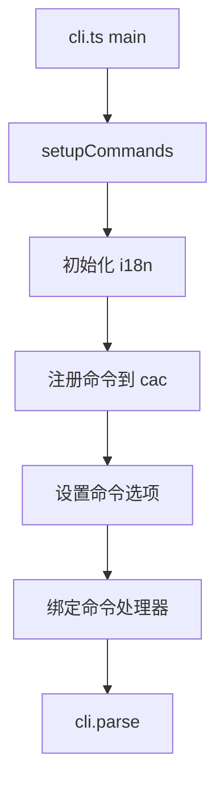
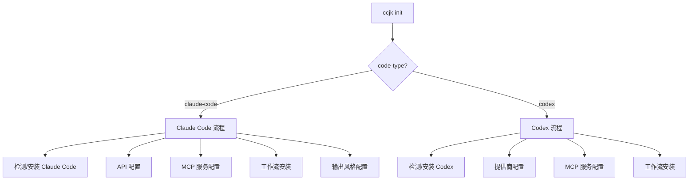
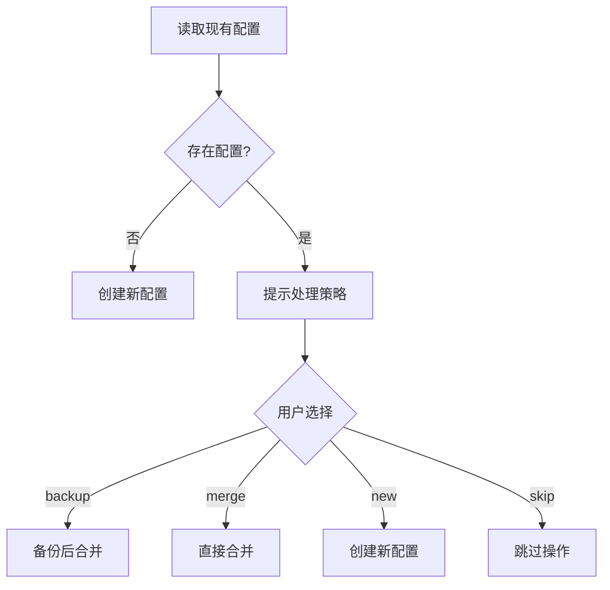
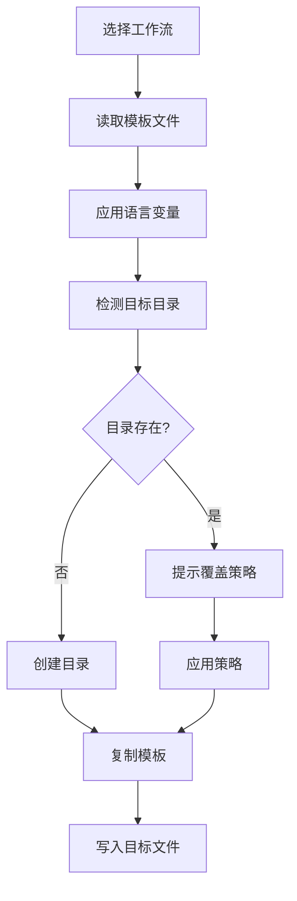

# 架构说明

本文档详细说明 CCJK 项目的架构设计、模块组织、关键流程和扩展点，帮助开发者理解和参与项目开发。

## 📋 目录

- [技术栈](#技术栈)
- [项目结构](#项目结构)
- [核心模块](#核心模块)
- [关键流程](#关键流程)
- [设计模式](#设计模式)
- [扩展点](#扩展点)

## 技术栈

### 核心技术

| 技术 | 版本 | 用途 |
|------|------|------|
| **TypeScript** | Latest | 主要开发语言（ESM-only） |
| **Node.js** | >= 22 | 运行环境 |
| **pnpm** | >= 10.17.1 | 包管理器 |
| **cac** | Latest | CLI 参数解析 |
| **unbuild** | Latest | 构建工具（ESM-only 输出） |
| **Vitest** | Latest | 测试框架 |
| **i18next** | Latest | 国际化框架 |
| **tsx** | Latest | TypeScript 开发执行器 |

### 关键依赖

- **pathe**: 跨平台路径操作
- **tinyexec**: 跨平台命令执行
- **inquirer**: 交互式 CLI 提示
- **ansis**: ANSI 颜色和样式
- **dayjs**: 日期处理

## 项目结构

### 目录层次

```
ccjk/
├── bin/
│   └── ccjk.mjs              # CLI 可执行入口
├── src/                     # 源代码
│   ├── cli.ts              # CLI 主入口（cac 初始化）
│   ├── cli-setup.ts        # 命令注册和设置
│   ├── constants.ts        # 项目常量定义
│   ├── types.ts            # 全局类型定义
│   ├── index.ts            # 模块导出入口
│   │
│   ├── commands/           # CLI 命令实现
│   │   ├── init.ts         # 完整初始化（1200+ 行）
│   │   ├── menu.ts         # 交互式菜单
│   │   ├── update.ts       # 工作流更新
│   │   ├── ccr.ts          # CCR 管理入口
│   │   ├── ccu.ts          # 使用分析
│   │   ├── check-updates.ts # 版本检查
│   │   ├── config-switch.ts # 配置切换
│   │   └── uninstall.ts    # 卸载功能
│   │
│   ├── utils/              # 工具函数库
│   │   ├── config.ts       # 配置管理核心
│   │   ├── installer.ts    # Claude Code 安装
│   │   ├── platform.ts     # 平台检测和适配
│   │   ├── workflow-installer.ts # 工作流安装
│   │   ├── mcp-selector.ts # MCP 服务选择
│   │   ├── output-style.ts # 输出风格管理
│   │   ├── error-handler.ts # 错误处理
│   │   │
│   │   ├── ccr/           # CCR 集成模块
│   │   │   ├── config.ts   # CCR 配置管理
│   │   │   ├── installer.ts # CCR 安装
│   │   │   ├── commands.ts # CCR 命令执行
│   │   │   └── presets.ts  # CCR 预设配置
│   │   │
│   │   ├── cometix/       # CCometixLine 集成
│   │   │   ├── installer.ts
│   │   │   ├── commands.ts
│   │   │   ├── menu.ts
│   │   │   └── errors.ts
│   │   │
│   │   ├── code-tools/    # Codex 集成模块
│   │   │   ├── codex.ts   # Codex 主逻辑
│   │   │   ├── codex-configure.ts
│   │   │   ├── codex-config-switch.ts
│   │   │   ├── codex-platform.ts
│   │   │   └── ...
│   │   │
│   │   └── tools/         # 工具集成
│   │       ├── ccr-menu.ts
│   │       └── index.ts
│   │
│   ├── config/            # 配置定义
│   │   ├── workflows.ts   # 工作流配置
│   │   ├── mcp-services.ts # MCP 服务配置
│   │   └── api-providers.ts # API 提供商预设
│   │
│   ├── i18n/              # 国际化系统
│   │   ├── index.ts       # i18next 初始化
│   │   └── locales/       # 翻译文件
│   │       ├── zh-CN/     # 中文翻译
│   │       └── en/        # 英文翻译
│   │
│   └── types/              # TypeScript 类型定义
│       ├── workflow.ts
│       ├── config.ts
│       ├── ccr.ts
│       ├── claude-code-config.ts
│       └── toml-config.ts
│
├── templates/             # 配置模板
│   ├── claude-code/       # Claude Code 模板
│   ├── codex/            # Codex 模板
│   └── common/           # 共享模板
│       ├── output-styles/  # AI 人格风格 (en, zh-CN)
│       └── workflow/       # 共享工作流
│           ├── git/        # Git 命令 (commit, worktree 等)
│           └── sixStep/    # 六阶段开发工作流
│
├── tests/                 # 测试文件
│   ├── unit/             # 单元测试
│   ├── integration/      # 集成测试
│   ├── commands/         # 命令测试
│   ├── utils/            # 工具函数测试
│   └── ...
│
└── dist/                  # 构建输出（不提交）
```

## 核心模块

### 1. CLI 入口层 (`src/cli.ts` + `src/cli-setup.ts`)

**职责**：
- CLI 框架初始化（使用 `cac`）
- 命令注册和参数解析
- i18n 系统初始化
- 错误处理和退出码管理

**关键函数**：
```typescript
// cli.ts
async function main(): Promise<void> {
  const cli = cac('ccjk')
  await setupCommands(cli)
  cli.parse()
}

// cli-setup.ts
export async function setupCommands(cli: CAC): Promise<void>
```

### 2. 命令层 (`src/commands/`)

**职责**：实现各个 CLI 命令的业务逻辑

**模块组织**：

| 命令 | 文件 | 主要功能 | 复杂度 |
|------|------|---------|--------|
| `init` | `init.ts` | 完整初始化流程 | ⭐⭐⭐⭐⭐ |
| `menu` | `menu.ts` | 交互式菜单系统 | ⭐⭐⭐⭐ |
| `update` | `update.ts` | 工作流和模板更新 | ⭐⭐⭐ |
| `ccr` | `ccr.ts` | CCR 管理入口 | ⭐⭐ |
| `ccu` | `ccu.ts` | 使用分析执行 | ⭐ |
| `check-updates` | `check-updates.ts` | 工具版本检查 | ⭐⭐⭐ |
| `config-switch` | `config-switch.ts` | 配置切换 | ⭐⭐⭐⭐ |
| `uninstall` | `uninstall.ts` | 卸载和清理 | ⭐⭐⭐⭐ |

### 3. 工具层 (`src/utils/`)

**职责**：提供可复用的工具函数和业务逻辑

**核心模块**：

#### 配置管理 (`config.ts`)
- 配置读取和写入
- 增量配置合并
- 备份创建和恢复

#### 安装器 (`installer.ts`)
- Claude Code CLI 检测和安装
- 跨平台安装脚本生成
- 版本验证

#### 平台适配 (`platform.ts`)
- 操作系统检测（Windows/macOS/Linux/Termux）
- 路径处理适配
- 命令执行适配

#### 工作流安装器 (`workflow-installer.ts`)
- 工作流模板选择
- 模板复制和定制
- 依赖解析

### 4. 集成模块

#### CCR 集成 (`src/utils/ccr/`)
- CCR CLI 安装和配置
- 配置文件管理
- 预设提供商支持
- Web UI 启动和管理

#### Codex 集成 (`src/utils/code-tools/`)
- Codex CLI 检测和安装
- TOML 配置管理
- 提供商切换
- 增量配置合并

#### CCometixLine 集成 (`src/utils/cometix/`)
- 状态栏工具安装
- 配置管理
- 错误处理

### 5. 国际化系统 (`src/i18n/`)

**架构**：
- **框架**: i18next
- **组织**: 命名空间（namespace）分离
- **语言**: zh-CN, en
- **命名空间**: common, cli, menu, errors, api, tools, workflow, uninstall 等

**使用模式**：
```typescript
import { i18n } from '../i18n'

// 基本使用
i18n.t('common:success')

// 格式化
format(i18n.t('api:keyRequired'), { field: 'API Key' })
```

### 6. 配置定义 (`src/config/`)

**职责**：集中管理系统配置常量

- `workflows.ts`: 工作流定义和元数据
- `mcp-services.ts`: MCP 服务配置和依赖
- `api-providers.ts`: API 提供商预设

## 关键流程

### 1. 命令注册流程



### 2. 初始化流程（`init` 命令）



**关键步骤**：
1. **环境检测**: 检查 Node.js 版本、工具安装状态
2. **配置备份**: 自动备份现有配置
3. **增量管理**: 检测现有配置，提示处理策略
4. **配置应用**: 合并或创建新配置
5. **验证**: 验证配置有效性

### 3. 配置合并流程



### 4. 工作流安装流程



## 设计模式

### 1. 命令模式

每个命令是独立的模块，通过 `setupCommands` 统一注册：

```typescript
// commands/init.ts
export async function init(options: InitOptions): Promise<void>

// cli-setup.ts
cli
  .command('init', 'Initialize Claude Code environment')
  .alias('i')
  .action(async (options) => {
    await init(options)
  })
```

### 2. 策略模式

配置处理策略（backup/merge/new/skip）：

```typescript
switch (action) {
  case 'backup':
    await backupExistingConfig()
    await mergeConfig()
    break
  case 'merge':
    await mergeConfig()
    break
  // ...
}
```

### 3. 工厂模式

不同工具类型的安装器：

```typescript
// 根据 code-type 选择安装器
const installer = codeType === 'codex' 
  ? new CodexInstaller() 
  : new ClaudeCodeInstaller()
```

### 4. 适配器模式

跨平台路径和命令适配：

```typescript
// platform.ts
export function getConfigPath(): string {
  if (isWindows()) {
    return join(homedir(), 'AppData', 'Local', '.claude')
  }
  return join(homedir(), '.claude')
}
```

## 扩展点

### 1. 添加新命令

**步骤**：

1. **创建命令文件**：
   ```typescript
   // src/commands/new-command.ts
   export interface NewCommandOptions {
     // 选项定义
   }
   
   export async function newCommand(options: NewCommandOptions): Promise<void> {
     // 实现逻辑
   }
   ```

2. **注册命令**：
   ```typescript
   // src/cli-setup.ts
   import { newCommand } from './commands/new-command'
   
   cli
     .command('new-command', 'Description')
     .option('--option', 'Option description')
     .action(async (options) => {
       await newCommand(options)
     })
   ```

3. **添加测试**：在 `tests/commands/` 添加测试文件

4. **更新文档**：更新 GitBook 文档

### 2. 添加新工作流

**步骤**：

1. **创建模板文件**：在 `templates/claude-code/workflows/` 或 `templates/codex/workflows/`
2. **注册配置**：在 `src/config/workflows.ts` 添加定义
3. **更新安装器**：确保 `workflow-installer.ts` 支持新工作流
4. **添加翻译**：在 `src/i18n/locales/` 添加翻译
5. **测试验证**：添加集成测试

### 3. 添加新 MCP 服务

**步骤**：

1. **注册服务**：在 `src/config/mcp-services.ts` 添加配置
2. **创建模板**：在 `templates/` 添加 MCP 配置模板
3. **更新选择器**：确保 `mcp-selector.ts` 支持新服务
4. **文档更新**：在功能文档中添加说明

### 4. 添加新 API 提供商预设

**步骤**：

1. **添加预设**：在 `src/config/api-providers.ts` 添加提供商定义
2. **测试验证**：确保预设配置正确
3. **文档更新**：在 API 提供商文档中添加

## 数据流

### 配置读取流程

```
用户输入 → 命令解析 → 选项验证 → 配置读取 → 业务逻辑 → 配置写入 → 结果反馈
```

### 错误处理流程

```
异常抛出 → error-handler 捕获 → 错误类型判断 → i18n 错误消息 → 用户友好的错误提示
```

## 性能考虑

1. **懒加载**：大型依赖按需加载
2. **异步操作**：文件操作和命令执行使用异步
3. **缓存机制**：模板读取和配置解析结果缓存
4. **并行执行**：独立的操作并行执行

## 安全考虑

1. **API 密钥处理**：敏感信息加密存储
2. **路径验证**：防止路径遍历攻击
3. **命令注入防护**：使用安全的命令执行方式
4. **配置文件权限**：设置合理的文件权限

## 相关文档

- [贡献指南](contributing.md) - 参与开发的详细指南
- [测试指南](testing.md) - 测试编写和运行
- [CLAUDE.md](https://github.com/miounet11/ccjk/blob/main/CLAUDE.md) - 项目完整架构文档
